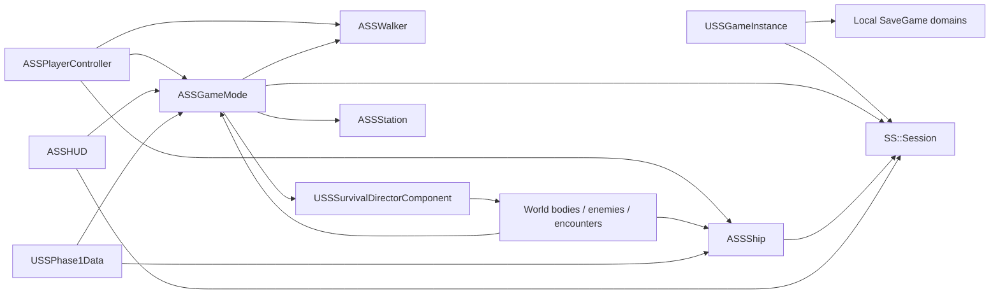

# SpaceSurvival Phase 1 architecture

> Reboot checkpoint, 2026-09-13 04:35 UTC: the editor C++ build **succeeded** using MSVC14.51.36257 and Windows SDK10.0.26100.0; earlier missing-toolchain statements below are historical and superseded. Current portable tests pass372 assertions in each strict/sanitizer build. Gameplay content creation, Unreal save-test execution, package and player validation remain pending. See [PROJECT_STATE](PROJECT_STATE.md) for resume order.

This document describes the source implementation inspected on 2026-09-13. Portable rules have passed 372 assertions under strict GCC 14 and ASan/UBSan builds. Real assets have also been imported and reloaded in UE 5.8.2, independently of the gameplay module. UBT now recognizes the owner's installed MSVC 14.51.36257 and Windows SDK 26100; a native build is in progress after updating target build settings for UE 5.8. Successful Unreal C++ compilation, the gameplay map, packaged execution and a played run remain unverified. `GAME_SCOPE.md` and `IMPLEMENT.md` remain authoritative.

## Project structure and ownership

The project targets Unreal Engine 5.8 with one C++20 runtime module, `SpaceSurvival`, and game/editor targets. `Config/DefaultEngine.ini` selects `/Game/SpaceSurvival/Maps/Survival`, `ASSGameMode` and `USSGameInstance`. `Scripts/AuthorContent.py` imports content and authors the native-class-dependent map/data asset after the module builds. An asset-only descriptor has allowed real geometry, materials, skeletal content and audio import while C++ tooling is pending; it does not provide the gameplay runtime. `Survival` and `DA_Phase1` still require the native classes.

| Owner | Actual responsibility | Important boundary |
| --- | --- | --- |
| `SS::Session`, `Run`, `Account`, `Settings`, `Tuning` in `Domain/SurvivalCore.*` | Engine-independent phase transitions, flight resources, damage/recovery, effective ship stats, purchases, utilities, contracts, score/XP/unlocks and strict text codecs | Owns rules and values, not actors, collision queries, rendering or file I/O |
| `USSGameInstance` | Holds the session across pawn changes; local SaveGame domain reads/writes; consumption of suspended runs; account protection; graphics/settings application | Only adapter that accesses Unreal save slots |
| `USSStoredData` | Version, validity flag and UTF-8-converted string payload inside an Unreal `USaveGame` envelope | Payload semantics and their separate version migration belong to the domain codecs |
| `ASSGameMode` | Boot/hangar flow, spawning and possession, phase-change reactions, station approach/docking, gameplay notification handling, shell/menu actions and music-layer levels | Coordinates the session and world; does not replace the domain's authoritative wave timer |
| `ASSPlayerController` | Keyboard/mouse and gamepad polling, menu navigation/hit testing, input sensitivity/inversion and hold/toggle latches | Sends flight/walk/interact/fire requests to the current pawn/GameMode |
| `ASSShip` | Swept flight movement, velocity/inertia, banking, external force accumulation, boost/brake movement response, dodge impulse, chase camera, aim assistance, firing and ship feedback | Resource/damage/stat calculations delegate to `SS::Session` |
| `USSSurvivalDirectorComponent` | Pressure/budget accumulation, spawn admission, hazard/enemy composition, one-time encounter offers and threat cleanup | Owned by GameMode; consumes wave/phase information rather than advancing waves |
| `ASSWorldBody` | Common physical radius, presentation, motion, lifetime, weapon-target contract, environmental contact/field effects, fragmentation and drops | Common base for hazards and specialized world actors |
| `ASSEnemy` | Pursuer/flanker approach geometry, committed shot telegraph, projectiles, obstacle avoidance/contact and event-objective progress | Shares world hazards; health does not inflate with wave count |
| `ASSProjectile` | Swept travel, ordered collision processing, source filtering and damage delivery | Player cannon/enemy shots are physical actors; laser damage uses a trace with a zero-damage visual tracer |
| `ASSWormholePassage` | Wave 5 ring corridor, increasing pull and bounded centering force | Presentation/force only; it never changes the phase or adds a fifth hazard family |
| `ASSPickup` | Credit/repair/shield/buff silhouette, local attraction/collection and optional salvage-objective callback | Calls GameMode once on collection; no surprise utility equip |
| `ASSEncounterBeacon` | Explicit acceptance, salvage/distress objectives, timeouts, depot subset/discount and proximity | Completed objectives grant reward eligibility; proximity alone does not finish an event |
| `ASSStation` | Compact runtime-authored home/station geometry, physical services, signage, lighting, selected ship display, moving service arm, primitive Mica service avatar and ambience | Services resolve to specific `ESSPanel` interactions; layout/vendor animation remains native C++ |
| `ASSWalker` | Third-person walk/run/look with CharacterMovement, supplied walking animation and a 1.4-second procedural disembark transition | No station combat or platforming system; procedural exit is not a finished authored animation |
| `ASSHUD` | Canvas text/meters, targeting/radar/encounter/docking indicators, contextual interaction prompts and menu hit rectangles | Reads session/GameMode state; menu action execution remains in GameMode |
| `SSContentTypes.h` | Shared reflected world/encounter identities and hazard, enemy, pickup, encounter and Director-tuning structs | Fixed Phase 1 identities; data definitions do not create new native behavior types |
| `USSPhase1Data` | Editor-editable core tuning plus six hazard presentations, two enemies, four pickups, three encounters and Director content settings | Numeric/presentation catalog is implemented in source; native class factories, utility/contract policy and station layout remain outside it |

This is a single-player architecture. Accesses to player/controller index `0`, one active ship, one session and `GetAuthGameMode` are intentional current assumptions. It contains no replicated session model or implemented co-op abstraction.

## Runtime flow and phase authority

`USSGameInstance::Init` loads account/settings and applies settings. `ASSGameMode::BeginPlay` copies supported `DA_Phase1` values into domain tuning/Director properties, starts the three aligned music sources, creates a home hub/walker, and opens the main shell. The GameMode sets `DefaultPawnClass` to null and explicitly spawns/possesses the required pawn.

Starting a run first persists the existing account. It constructs a candidate session with a new GUID-based run ID, validates ship/weapon unlocks, durably invalidates an older suspension, then exposes the new session and spawns flight at `(0, 0, 7000)`. `StartRun` clears run upgrades, credits, utilities, contracts and event/depot flags while retaining account/settings.

`SS::Session::Tick` advances hidden phase timing. Ordinary waves move through `Flight -> Breathing -> next Flight`. Breathing durations are clamped to at most 20 seconds. Wave 5 routes `Flight -> Wormhole -> Climax -> Approach -> Docking -> Station`. Wave 10 starts in `Climax` and then uses the same approach/docking/station path. `ASSGameMode` observes phase changes, configures the Director, creates the wormhole passage, places the arriving station and switches between ship/walker possession.

Approach remains player-controlled. Within the docking distance/orientation test, GameMode calls the domain's `BeginDocking` and supplies the ship's landing target. The domain controls completion timing; `ASSShip` interpolates toward the target. Station entry retires encounter actors and transfers possession to the walker while retaining the docked physical ship. `FinishDocking` snaps to the final dock transform, hides the pilot component, stops engine audio, disables flight collision and disables the ship actor tick. The hub hides its display ship when the physical ship occupies the bay. Station 1 launch retains the active run and begins Wave 6 with a newly spawned flight pawn.

Station 2 is an explicit Phase 1 content boundary. `AtSliceBoundary` recognizes an active Wave 10 station state; `LaunchFromStation` refuses to create Wave 11. The shell offers suspension or an explicitly labeled abandonment without death XP. Reaching Station 2 is not coded as a final-wave victory or an automatic XP/death event.

`ASSWalker::BeginDisembark` disables movement/capsule collision and moves the walker from the cockpit to a station-local exit point along an eased 1.4-second arc while the view blends to the walking camera. It then restores walking/collision. Origin shifts adjust the cached endpoints. Resume reconstructs the hub/display ship and walker directly from station run state. Launch/hangar changes clean up the retained ship and previous pawn/hub. This is a procedural presentation implementation requiring actual collision, camera and animation inspection; it is not a verified near-alpha exit sequence.

## Flight, defense and combat

The controller combines mouse deltas, stick input and discrete controls, then `ASSShip` clamps steering/strafe and computes desired forward/lateral velocity. Response uses exponential interpolation, an acceleration limit and bounded movement substeps. Physics-facing movement uses Unreal sweeps for static obstacles; world bodies separately compute relative swept contact against the ship. Banking is applied to the hull presentation component while the pawn's pitch/yaw determine travel.

`Session::TickFlight` owns rechargeable boost, brake heat/hysteresis and boost/brake priority. `Session::Dodge` supplies the cooldown gate; `ASSShip::RequestDodge` adds a directional velocity impulse. Neither creates collision immunity. The core's damage path drains shield before hull, applies energy shield pressure and lightweight temporary electrical/gravity/thermal effects, interrupts recovery, and can temporarily reduce an upgraded subsystem's effective tier. Purchased tiers remain unchanged. Shield has no automatic regeneration. Delayed hull recovery uses separate danger/safe rates.

Manual camera-forward aim always supplies the firing direction. The ship selects an eligible nearby target within an angular cone/range and line-of-sight check; firing interpolates partway toward that target. Rapid Laser deals traced damage and spawns a visual tracer. Heavy Cannon creates a damaging swept projectile. `Session::Stats` applies the active weapon, Weapon I–V and temporary overcharge modifiers. Only one active weapon and one utility value exist in run state.

This source structure supports separate rule testing, but geometric movement, controller response, aim readability, collisions and feel still require engine playtests. The 120 Hz target movement subdivision is capped at 32 steps per frame; it is not proof of stability under arbitrary stalls.

## Director, world actors and opportunities

The Director accumulates a bounded spending budget using wave level and `Session::PressureMultiplier`. Native composition rules select from the fixed catalog using configured eligibility, weights, costs, intervals and caps to introduce enemies, wreckage, storms and gravity over Waves 1–10. A new wave updates configuration without destroying existing actors. Bodies expire through lifetime/distance rules, while `ResetEncounter` destroys world bodies on station/death/reset transitions.

Admission considers closing-speed-based lead time, a reserved lateral lane, player clearance, physical body separation, separated environmental field envelopes and an active-threat cap. Fields may intentionally overlap physical hazards. The Wave 10 climax requests a gravity field before mixed pressure; the Wave 5 combat climax prioritizes enemy spawns. These are preventative rules, not a demonstrated fairness guarantee.

Small/medium rocks can be shot, massive bodies and large wreckage are navigation obstacles, and medium rock destruction emits at most three dangerous fragments subject to threat capacity. Gravity applies bounded acceleration to the ship and eligible debris/enemies. Electrical fields telegraph before pulsing damage. Enemies commit shot aim before discharge and share environmental obstacle interactions.

Encounter definitions default to salvage during Wave 2, the guaranteed mobile depot during the Wave 3 breathing window, and distress/combat during Wave 7. Offered wave, delay, geometry, objective count/duration and related numeric content are editor-editable; the exactly-once depot/breathing policy remains native. Seen/accepted flags live in `Run`; live objectives and beacon timers are transient actor state. Acceptance creates physical salvage caches/wreckage or objective-linked attackers, using the scoped defaults of three caches or two attackers. Success calls `NotifyEventCompleted`, granting credits plus an explicitly selected utility/weapon reward; timeout forfeits the optional reward.

Depots offer three shuffled upgrade tracks and one of two configured discounts. The domain purchase method checks run state, tier/pricing and credits; the GameMode additionally verifies the currently offered subset and live proximity. The depot panel does not pause flight. Standard shell/settings panels can pause active flight; reward/depot panels continue the universe while the ship receives neutral flight input.

## Economy and progression

`Run` stores five purchased tiers, credits and performance counters. `Session::Stats` derives effective capabilities each time instead of mutating a growing set of permanent stat bonuses. Purchases increase capacity/capability without implicitly repairing hull or refilling shield. Station repair restores durability and clears temporary damage. The agile chassis applies speed/response/maneuver advantages with reduced starting hull.

One active contract is supported. The pressure contract temporarily reduces shield capacity and raises pressure; the objective contract counts kills before Station 2. Contract resolution occurs on docking into the next station and pays a reward only when its target is met. Resetting capacity never grants free shield energy.

`Session::EndRun` sets the run inactive/dead and computes score/XP once per run ID. Account level derives from XP; Heavy Cannon starting access begins at level 2 and agile ship access at level 3. Persistent progression unlocks starting choices rather than applying permanent stat multipliers. GameMode shows results and prevents a new run until progression persistence succeeds.

`Account::history` retains at most ten completed runs, newest first. `RunHistoryEntry` stores run ID, reached wave, score, XP, kills, total credits earned before purchases, ship and the active weapon at death. Appending an eleventh entry evicts the oldest record without changing cumulative XP, run count or best result. Duplicate death/replayed retained IDs do not append or award again. Explicit slice abandonment resets run state without XP or a history record. The progression panel opens a history view with three records per page.

## Local save protocol and its limits

Three independent slots use `USSStoredData` envelopes:

| Slot | Payload | Lifecycle |
| --- | --- | --- |
| `SS_Account_v1` | `ACCOUNT` payload v2: XP/level, last/best result, latest awarded ID, tutorial flags and up to ten history entries | Reads original account payload v1; next successful write uses v2 without changing the outer slot/envelope |
| `SS_Settings_v1` | `SETTINGS` codec: graphics, audio, controls and accessibility preferences | Loaded on boot and persisted on setting changes/suspension |
| `SS_Suspend_v1` | `RUN` codec: live station run, purchased tiers, meters, counters, contract, flags, pending reward and domain RNG | Written only at a station; consumed before resume |

The codecs have versioned headers, explicit numeric/enum/string bounds and state invariants. They reject truncated, trailing, oversized, non-finite or inconsistent data and leave the destination unchanged on failure. They do not access disk. Station suspension reconstructs the safe hub from logical run state; it does not serialize actors, positions, Director actor RNG or a live flight scene.

Account v1 migration preserves all available progression/summary/tutorial fields and starts the new history empty. It does not fabricate absent historical ship, weapon, kills or credits. Account v2 rejects more than ten records, duplicate IDs, invalid fields, history XP exceeding account XP and a newest entry inconsistent with the account's latest summary. Run/settings payloads and the `USSStoredData` envelope remain v1.

`WriteDomain` writes through Unreal's `SaveGameToSlot`, reloads the envelope, and compares validity/payload before confirming success. Suspending first persists account/settings, then the station run. Both `HasSuspendedRun` and `ResumeRun` exclude IDs matching the latest awarded marker or any retained history entry. Resuming decodes into a candidate, writes an invalid suspension tombstone, and only then assigns the candidate to the active session. Disk failure prevents exposing resumed gameplay. The ten-entry history is not an unlimited anti-replay ledger.

On death the domain awards XP in memory once; the adapter persists the account, including `lastAwardedRunId`, before invalidating suspension. The account marker excludes a stale matching suspension if interruption occurs between those two writes. Failure leaves the results screen requiring a retry before another launch. Starting a new run also invalidates an older suspended run before replacing the active session.

If an existing account slot cannot be decoded/read, `AccountStorageBlocked` protects it from overwrite and blocks account persistence/resume/new-run progression. Invalid settings leave defaults available. These behaviors still require real filesystem failure/relaunch tests. There is no transactional database, atomic multi-slot commit, backup manager, cloud conflict resolution or anti-tamper guarantee. Losing power or terminating the process is not claimed to have been fault-tested.

## Tuning and presentation authoring

`DA_Phase1` currently feeds hull/shield baselines, cruise/lateral/response/acceleration, base weapon damage, hidden wave duration ranges/growth, baseline wave credits/upgrade price, and three Director settings into their runtime owners. Ship-specific speed floors, boost multiplier, steering, dodge, chase distance, fire intervals/range and aim cone are read by `ASSShip`.

The shared content catalog is now represented by real reflected source types rather than future-only placeholders:

| Catalog | Existing configurable content consumed by World/Director |
| --- | --- |
| Six `FSSHazardDefinition` entries representing the four authorized families | Mesh name, minimum wave, selection weight, pressure cost, ordinary/climax radius, health/destructibility, collision damage growth, drift/lifetime, electrical telegraph/pulse, gravity strength/velocity fractions, bounded fragments/drops, and wreckage passage dimensions |
| Two `FSSEnemyDefinition` entries | Mesh/eligibility/cost/radius/health, approach offsets/orbit amplitudes, response/catch-up growth, shot telegraph/interval/projectile speed/damage/aim error, avoidance/hazard damage and credit-drop values |
| Four `FSSPickupDefinition` entries | Drop weight/amount, radius/attraction/collection/lifetime, canonical mesh name, tint and label |
| Three `FSSEncounterDefinition` entries | Offer wave/delay, beacon/lifetime/range, objective count/duration/lead, cache/debris placement and values, attacker contact damage and two depot price fractions |
| `FSSDirectorContentTuning` | Enemy/field/wreckage composition thresholds, spawn intervals, budget capacity/growth, pressure curve and early/late/climax enemy caps |

The `Hazards`, `Enemies`, `Pickups` and `Encounters` arrays are `EditFixedSize`; identity fields are read-only in ordinary editing. Lookup methods return the matching definition or a native default for that existing identity. World consumers resolve mesh names beneath `/Game/SpaceSurvival/Meshes`, apply physical definitions and use catalog weights/costs during selection. This fixes the Phase 1 roster while allowing its content to be tuned. The reflected structs, rebuilt `DA_Phase1` and all consumers still await UHT/C++ compilation and runtime verification; source availability does not prove an editable asset has been generated successfully.

The domain retains additional native defaults for repair/contract rewards, price steps, regeneration/resource rates and phase timings. Composition policy, wormhole/station cadence, utility/contract rules, ship modifiers, station layout and menu text/actions remain native. `USSPhase1Data::MouseSensitivity` and `ControllerSensitivity` are currently declared but controller behavior reads `SS::Settings` instead. There is no arbitrary Blueprint class/asset registry or separate utility/contract/station authoring system yet.

The material/mesh/audio pipeline and exact asset paths are documented in `CONTENT_PIPELINE.md`. Generated sources are original provisional assets. UE 5.8.2 has imported 54 initial packages; `Saved/Validation/PersistedContent.json` records an independent fresh-process reload of 26 built static meshes, 11 palette materials, the supplied hero/shared walking skeleton and 2.4667-second walk animation, and ten audio assets. `ContentSource/UnrealAssetPreview.png` is an actual D3D12 stock-actor asset preview, not the SpaceSurvival gameplay map. Cooking, gameplay references and presentation quality remain open. Runtime fallback primitives and default tuning are development fallbacks, not a passing content gate. The C++ runtime still uses synchronous loads and native spawn classes, not an AssetManager or Blueprint class registry.

The authored background actors carry `SpaceBackdrop` and `SpaceStars` tags and movable mesh components. GameMode keeps them centered around the current pawn and slowly changes background tint using time/run state, independently of the station cadence. This is visual drift only; it does not introduce biome-specific gameplay. Tutorial flags are recorded from observed input/collection/acceptance actions rather than merely displaying guidance.

`ASSHUD` uses Unreal Canvas rather than a UMG widget hierarchy. UMG/Slate module dependencies do not mean such widgets exist. World signage uses TextRender components; menu hit rectangles support mouse selection, and controller/keyboard traversal share the same `FSSMenuEntry` list. Mica currently has a moving primitive service avatar with a head/visor/arm and text/vendor interaction, not a finished skeletal NPC. Dialogue captions are text announcements; labels are not recorded speech. Music sources start together and their layer volumes change with pressure/phase; smooth crossfades and the actual mix remain polish work.

The supplied GLB was additionally imported and rendered using the already-installed Blender 5.1.2. `ContentSource/HeroPreview.png` is a source preview, not an Unreal screenshot. The skinned source mesh has 202,507 Blender vertices and 196,920 polygons, with imported dimensions approximately 0.75 by 0.80 by 1.07 meters. An auxiliary unskinned `Icosphere` was excluded from preview framing. The source contains `walk_relaxed`; the source file and its SHA-256 remain unchanged. The first separate `A_Pilot` FBX-derived animation rendered with incorrect joint scale against the GLTF skeleton. A corrected GLTF animation has since imported against the existing skeleton with a four-second duration, bringing the pipeline to 56 packages including its import pipeline asset; its corrected pose render is still pending. File/import existence is not successful seated-pose validation. Check the latest content report and actual pose render before enabling or approving it. Neither source nor asset previews establish complete animation coverage, gameplay visibility or visual approval.

## Validation and performance boundaries

`Tests/CoreTests.cpp` exercises deterministic high-risk domain behavior, including damage/recovery, resource meters, utility replacement, all upgrade tiers, the two station routes, contracts, score/XP/unlocks, reset and strict codec round trips/rejections. `Scripts/TestCore.ps1` uses the repository Docker workflow. The test text explicitly distinguishes portable rules from Unreal integration and game feel.

`SSAutomationTests.cpp` contains `SpaceSurvival.Save.PayloadRoundTrip` for an Unreal in-memory envelope and `SpaceSurvival.Save.PlatformDiskRoundTrip` for platform disk APIs. The disk test creates unpredictable `SS_QA_<GUID>_Account`/`_Run` slots after checking they are absent, saves/reloads account v2 history and station state, overwrites only the QA run with an invalid consumed marker, verifies the QA account is unchanged, and deletes the exact QA slots through normal/early-return cleanup. It never accesses production account/settings/suspension slots. These UE tests are written but not yet executed. They do not establish process restart, the full GameInstance transaction, crash recovery, input or the ten-wave experience.

`Scripts/CheckProject.py` currently passes 20 source structural checks. `docs/validation/2026-09-13-domain-history.json` binds the 372-assertion strict/sanitizer evidence to matched Docker/local source hashes, without claiming the then-uncommitted source was a Git commit. Content-format validation checks OBJ/WAV integrity independently of actual engine import/reload evidence.

There are bounded actor lifetimes, reaction-distance admission, threat counts, fragment counts, projectile sweeps and world-origin rebasing above a 10 km local displacement. Rebasing adjusts the ship's docking target, tracked relative contact position and wormhole entry point. These measures support continued testing, but no 60 FPS measurement is established by their presence.

Current performance risks include per-frame actor iteration for targeting, radar, enemy avoidance and gravity; frequent actor creation/destruction; synchronous asset loading; runtime-generated hub components; high-detail supplied character geometry without an authored LOD workflow; and unprofiled Lumen/virtual-shadow/render settings. There is no object pool or spatial acceleration structure yet. Profile in an actual Windows build before replacing bounded systems or reducing critical warnings.

The present ownership split is real, but it remains an initial implementation: `ASSGameMode` combines substantial shell/session orchestration, and `SSWorldActors.cpp` contains several actor families in one translation unit. Extract content registries, presentation widgets and encounter policies only with scope-preserving validation. Phase 2 changes and migrations are discussed separately in `PHASE2_INTEGRATION.md`.
