# Owner holographic display references — October 7, 2026

Recorded October 8 UTC from the owner's October 7 evening screenshots. Related
work: **RPT-20261007-01 / RPT-20261006-04 / ISS-03/16**, resource **A34**.
This is a reference handoff for the next round. Unreal implementation remains
paused; no map, material, build or published package changed for this record.

## Owner direction

**Paraphrase:** the original five purchased kits contain many holographic windows
and display options. Most of the examples below are excellent candidates for the
ad displays. Use that breadth when choosing hardware; do not constrain the next
pass to the previously tried panel or treat the supply of suitable windows as a
gap requiring new assets.

These screenshots establish preferred hardware/effect families. They supersede
the earlier absence of positive owner references, but do not identify a single
final mesh/material/placement. The lead must match them to native assets when
work resumes; the owner should not have to recreate this shortlist. Keep controls
upright and purposeful. If using glass, embed the image into its translucent
holographic surface, with appropriate edge blending and restrained effects.
Preserve the hand-picked ad text and artwork; fit/reformat to the actual aperture
without clipping text. The central room remains information-first with at most
one or two ads; other themed rooms retain the five-distinct-campaign requirement.

## Breadth already available

The existing local picker was recounted for this handoff:

| Catalog scope | Count | Meaning |
| --- | ---: | --- |
| Hardware candidates across P1–P5 | 71 | Mixed display hosts/assemblies; not 71 holographic windows. |
| Companion parts | 60 | Frames, glass and supports; not additional complete displays. |
| Effect/style variants | 116 | Includes opaque and translucent styles; not 116 unique windows. |
| P4 V2 digital-window size variants | 15 | All combinations of named widths 200/300/400/500/600 and heights 100/200/250; matching frame previews are in the picker. |
| Records without usable static previews | 25 | Parts/effects explicitly marked missing; do not interpret them as absent assets. |

The 15 window variants and their local `.uasset` presence are recorded in the
[inventory and screenshot manifest](images/2026-10-07-holographic-displays/manifest.json).
This is a bounded catalog count, not an exhaustive count of every holographic
window placement in the example scenes. Repeated placements, size variants,
materials and unique hardware are different counts. Screenshots also show other
window, terminal and curved effect forms. Native behavior, fit and performance
remain next-round checks.

Local sources: `Content/P1toP5_Bundle` (P1 WorkStation, P2 StarterPack,
P3 ComputerStation, P4 Genesis Vol1, P5 FruitSeller), the combined test environment
described in [Building Sandbox](../BUILDING_SANDBOX.md), and
`.agent/local/Outpost/HoloAssetCatalog1/index.html`. The picker and licensed
assets remain private; this gallery and its source-identical screenshots are
tracked for the GitHub handoff. No exact screenshot-to-native-object match is
claimed yet.

## Large framed advertising windows

**Kit/example references supplied by the owner; current saved-station and
saved/unsaved editor state are unconfirmed.** Editor icons are present. These are
not new implementation or acceptance captures. Captions describe visible features;
still images do not establish animation timing or runtime performance.

**H01 — upright framed ad window:** illustration and text sit inside an
architectural glass surface, with frame and base support.

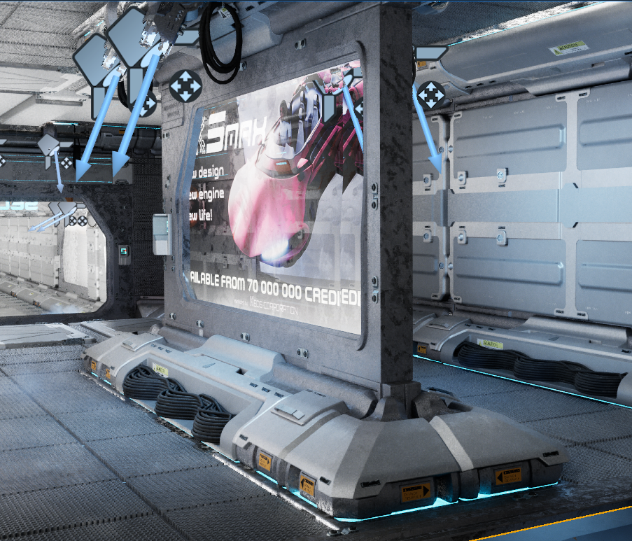

**H09 — wide advertising window:** large image/text region with visible background
and holographic breakup; useful reference for integrated ads.

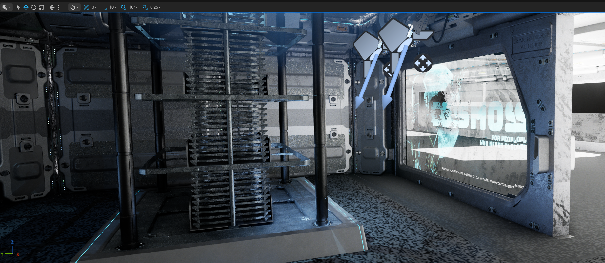

**H10 — multiple framed holographic displays:** humanoid imagery, transparency
and noisy/dissolving regions show alternative treatments. The strong breakup is
an effect reference, not a mandate to obscure readable copy.

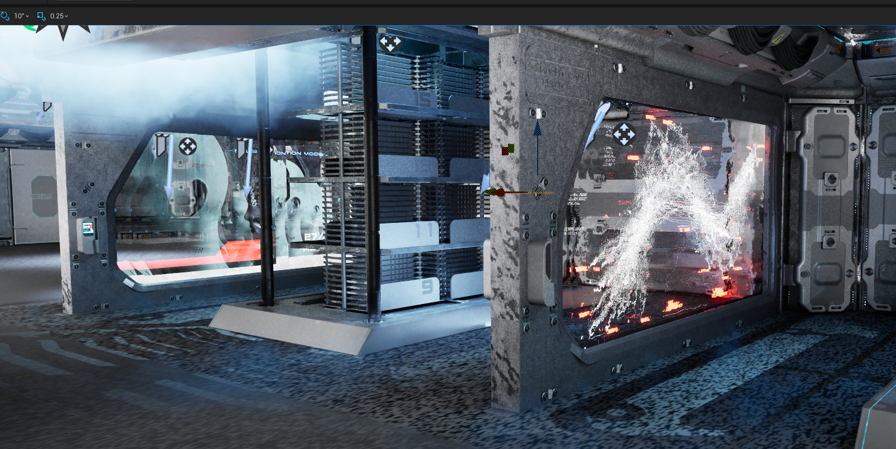

## Tall windows and transparent terminal displays

**H12 — additional architectural examples:** a large astronaut image occupies
the left opening, cyan information occupies another, and a separate right-hand
panel has a graphic overlay. Retain these as additional window/display choices;
do not reduce the shortlist to the large freestanding ad frame.

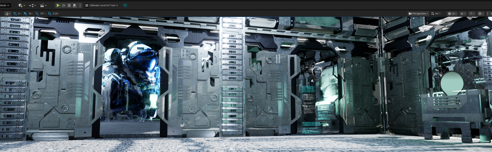

**H05 — paired transparent terminals:** cyan interface/keyboard graphics and
separate supporting bases. Consider information/ad roles without erasing useful
console functions or rotating their controls sideways.

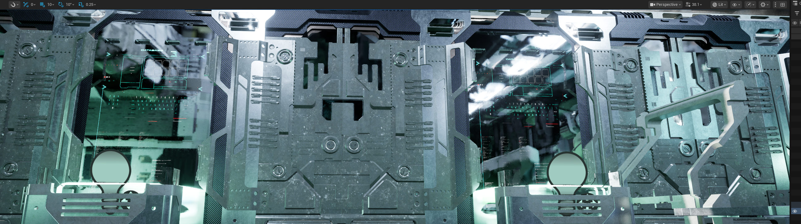

**H11 — room context and repeated options:** multiple tall panels, a side
information surface and the cylindrical effect demonstrate the available variety
and repeated architectural placements. This image is not a unique-asset census.

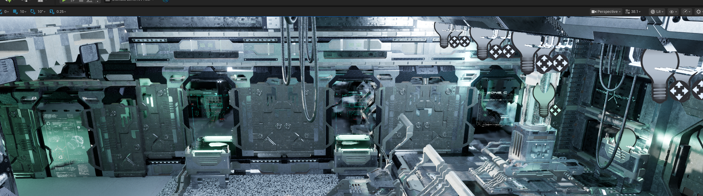

## Other glass and inset effects

**H02 — faceted glass opening with a honeycomb pattern:** surface/effect candidate;
ad readability and its exact native assembly still need checking.

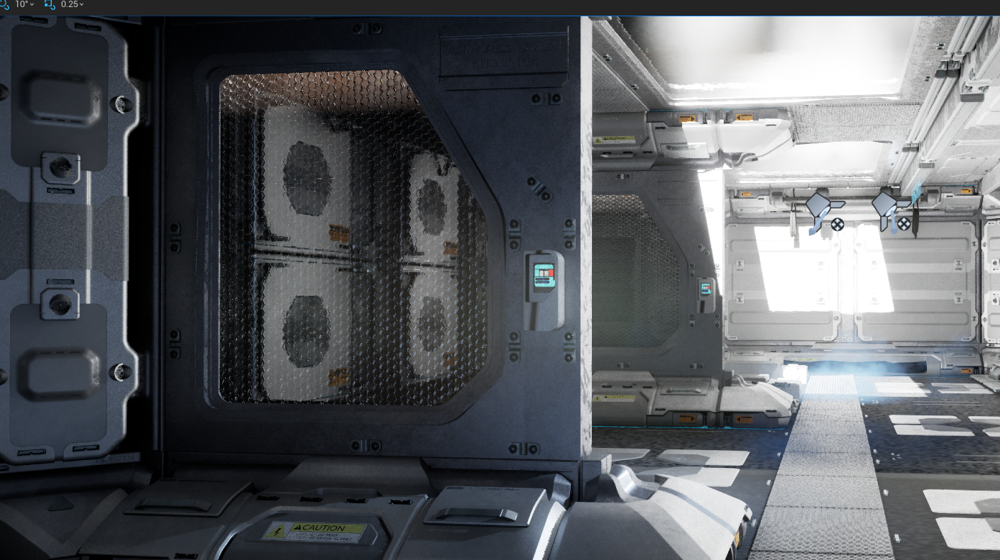

**H06–H08 — angled inset surfaces in a door assembly:** three supplied views show
clearer glass, digital noise and an UNLOCKED overlay. Preserve the effect reference
without assuming that pictured status text proves functional door behavior or
that functional door controls should become ads.

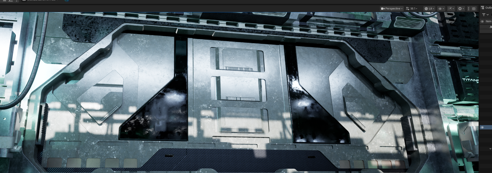

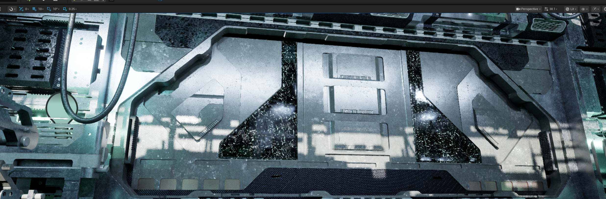

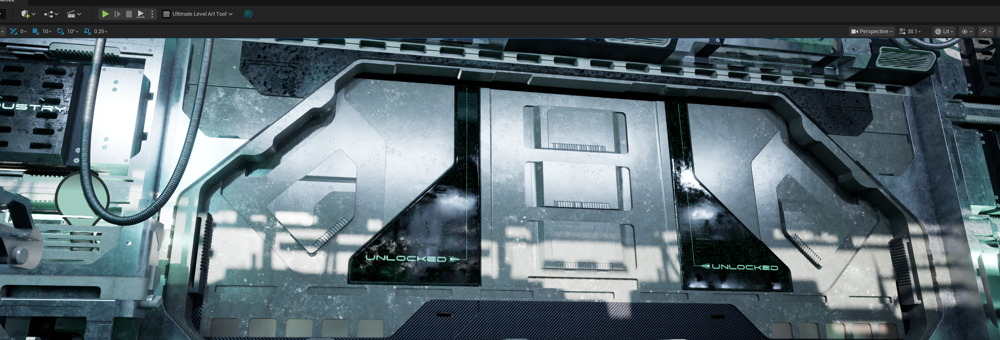

## Cylindrical holographic effect

**H03–H04 — curved luminous/noisy volume in a supported housing:** two views of
the cylindrical treatment. Retain as a complementary display/effect option;
readable flat ad copy and an actual projector mechanism are not established by
these stills.

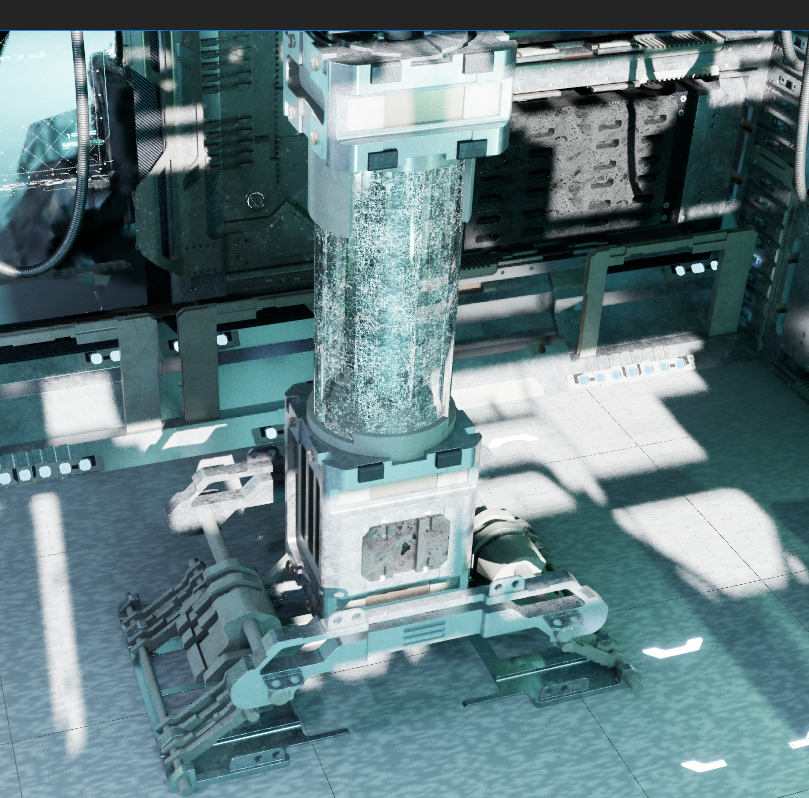

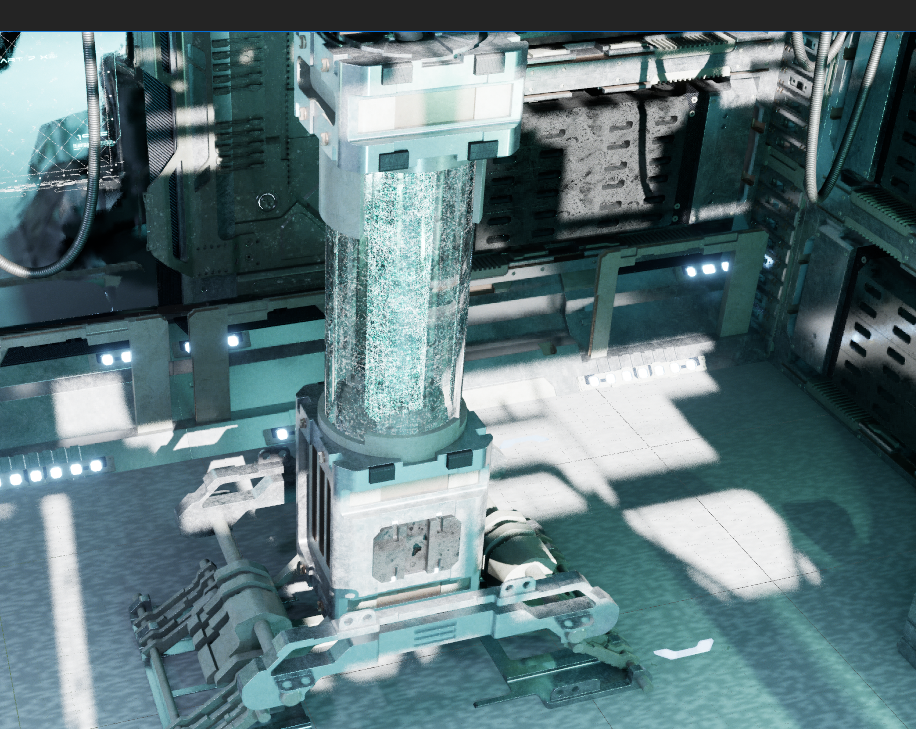

## Next-round handoff

Lead/contributor: map these reference families to exact native mesh, matching
frame, material and any Blueprint; compare upright assemblies in the target bay
and fit intact campaign layouts. Present the resulting placement for owner review,
then verify readable steady phases, transitions, walking clearance and cost.
Keep the previously rejected sideways controls, sticker-like edges and warranty
substitution rejected. Do not resume implementation from this documentation task.

The [canonical issue log](../KNOWN_ISSUES.md) retains ownership and acceptance;
this page is visual evidence, not another work queue. All 12 PNG copies retain
their original bytes and full dimensions; the manifest records attachment order,
original filename, byte length and SHA256. No crop, regeneration or recoloring
was performed.
