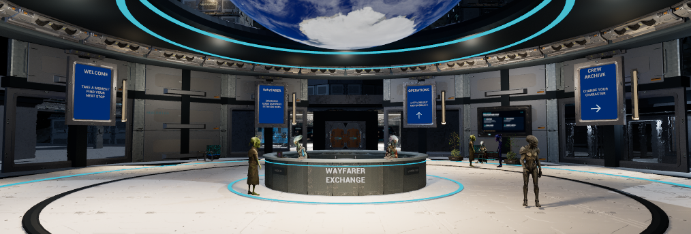
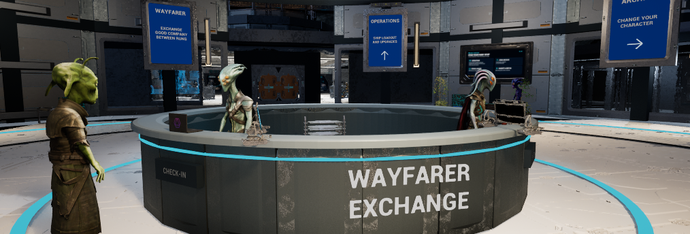
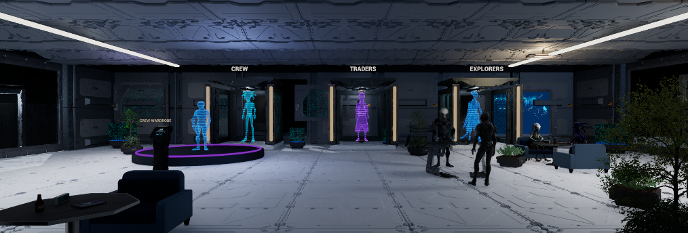
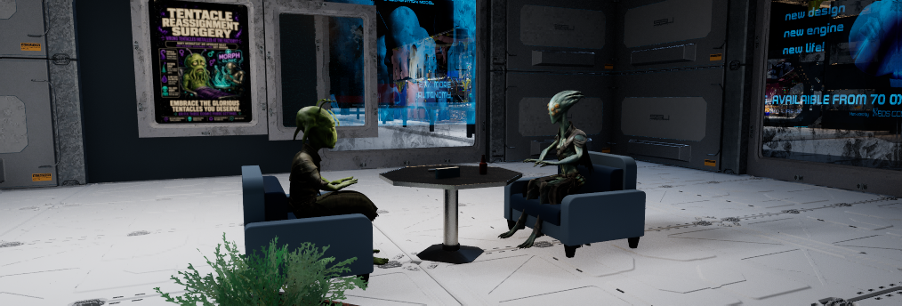
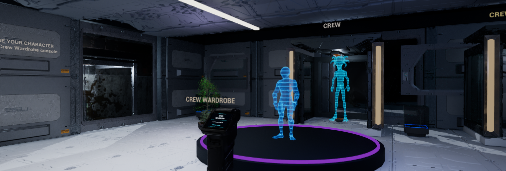

# October9 central/R concept-detail checkpoint

**PARTIAL / active goal.** This continues the owner's request to finish central
against the rendered concept and R to at least9/10. It does not certify that score
or ask the owner to finish the design. Later market, dock, lounge and cockpit
priorities remain active. T stays held. No graphic nudity in common areas; no
dancers. The earlier [whole-room correction](2026-10-09-central-r-whole-room-review.md)
is historical, not erased by this checkpoint.

Central has eight tall blue direction panels in upright original P4 frames,
warm rib fixtures, a darker detailed reception counter and readable nameplate.
Useful directory screens and the white low-gloss floor remain. Four planted
waiting bays gain understory; two seated readers hold tablets. A covered visitor
uses reception and a standing pair converse. Vendor labels do not restrict these
ambient roles. The owned trees remain variegated, not uniformly green.

R reuses three complete original-kit hologram assemblies as one rear-wall group,
with three distinct clothed cast projections and a matching wardrobe hologram.
Six owned Clinic armchairs and three furnished Restaurant tables replace hidden
mechanical seats. Four seated visitors share two tables; one table remains free.
Tablets, reading material, water, planted dividers and warm fixture strips give
the room purpose. Private textured palette variants preserve original maps.
Amethyst's exposed-body visitor is hidden/NoCollision and replaced by covered
Olive. Elf's preview was excluded. Source models are retained.

The actual wardrobe console/use point, selection behavior, saved Nyxar choice and
R's prior five-family ad display remain. No new interaction or AI voice was added.

## Verified state

| Evidence | Result and limit |
| --- | --- |
| Saved/reloaded Wayfarer | `f58ef8b6c730cf1c81a11ba992a0dcd585fcf30442133e9cb65324428c091c1d`;8,615 actors |
| Reload81 | Same map bytes and actor snapshots at1e-5 numeric tolerance; clean map/content packages |
| Furniture | Six chairs/three tables BlockAll; two private mesh copies each have one simple BOX. Original owned meshes remain unchanged. |
| Walk75 / Walk78 | 11/11 points over64.15m/22.30s and19/19 over108.20m/36.05s; ordinary native walking, possession restored, temporary pawn removed |
| Motion | Two seated readers and all eight new R ambient/projection actors advance compatible clips; sampled head/hand movement, not continuous-contact certification |
| Protected state | Account/settings/suspend, original preview, owner layout, Build55 DLL and ten pre-existing owner-edited files preserved |
| Native/source/release | Existing UE5.8.3 Build55 DLL`7b0ea67f`; source baseline`205e1318`; published0.1.22-alpha/itch2048604/sourcee6c2a87 unchanged |

Four native4-second seated derivatives preserve the owned Nyxar source loop
SHA`011d265a`. Source skeleton/material identity is preserved; per-character
seat/sole/hand fitting is still required for later variants. The walks use real
collision and normal movement input; they are not physical keyboard/controller
tests. No representative FPS/VRAM measurement, clean-install or package claim.

The three final images are ordinary1014×344 Play viewport frames from saved
candidate81. No exposure, quality or viewport override. The unusually wide
viewport limits vertical coverage; these views are not a complete motion review.
The root offscreen editor remains open for the active goal; PIE is stopped at
this checkpoint. [Sanitized native evidence, private-package and image hashes](station-concept-detail-20261009/evidence.json).

**Current saved candidate81 — room quality/owner acceptance remain open.**
Covered supplied cast and original kit surfaces are used; no temporary nude model.

**Current saved candidate81 — reception contact and text detail.** Continuous
staff hand/prop interaction is not certified by this still.

**Current saved candidate81 — R arrival.** Archive labels no longer overlap;
whole-room9/10 acceptance remains unestablished.

**Older intermediate candidate79 — unchanged seated group detail.** Later edits
only changed headers/nameplate; this photo is not the final saved-map capture.

**Older intermediate candidate79 — wardrobe and hologram treatment.** Its older
header size/position is superseded by candidate81.

## Retained failures and delivery boundary

The initial central stage failed on a native Skeleton property read. Native
rollback was verified before repair/retry; no blind rerun. Unsupported arrow
glyphs became native arrow geometry. R's first view exposed pale chairs and faint
holograms; textured tint and bounded material values corrected those. A read-only
collision probe used an unsupported BodySetup property; the supported subsystem
then verified source collision absence before private copies were made. Later
views exposed overlapping labels and a nameplate touching the counter lip; both
were corrected and recaptured. All intermediate receipts remain private.

BP_Blinds still reports Accessed None during StartPIE while the actual Survival
world runs. Each session verified that world before continuing; no blind restart.
The prior GPU crash remains unexplained. No driver, exposure or global quality
change was made.

Tracked helpers are `RefineStationConcept.py`, `AuthorStationVisitorSeats.py` and
`RefineStationArchiveConcept.py`. They are adopted authoring stages, not a general
scene generator. Native backups, the live map and39 private packages under
`Concept73`, `ArchiveConcept77` and `VisitorSeats20261009` remain local. GitHub
contains recipes, this receipt and unmodified PNG copies, not a complete licensed
restore. C++ did not change; no new C++ build/full gameplay suite was required.

Source/document checks passed:42 structural checks, Python compileall over Scripts
and ContentSource,26 source meshes/17 WAV validation, repository and prepared
ready-PR documentation gates, and whitespace checking. Those are source checks,
not Unreal visual or gameplay acceptance.
