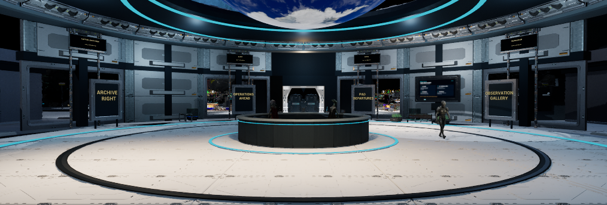
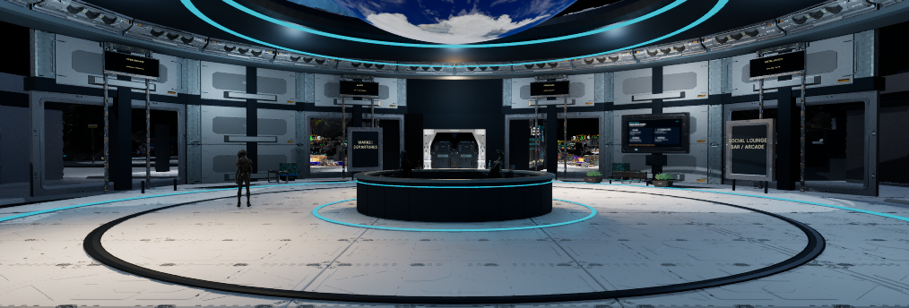
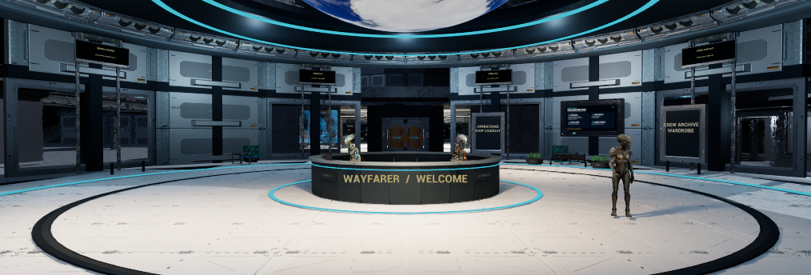
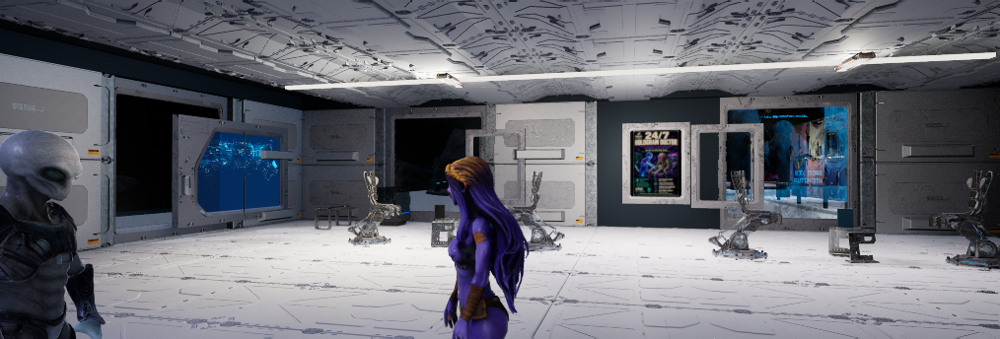
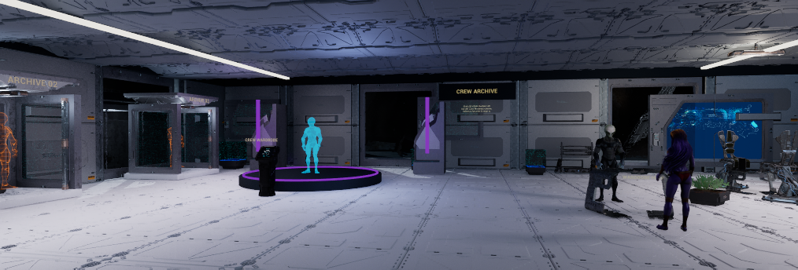
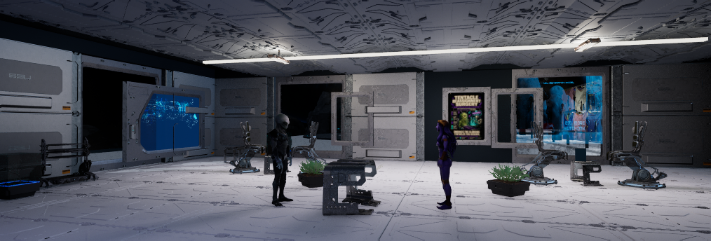

# October9 central/R whole-room correction

**PARTIAL — neither room is finished or approved.** The owner was right that the
earlier cast/prop pass did not apply the finishing discipline used for L/T. This
receipt supersedes that completion implication; it does not erase the earlier
[crew/hero checks](2026-10-09-station-crew-central-r.md).

Scope is central reception and R wardrobe/archive only. Accepted L, held T,
current cast/hero assignments, original kits, white floors and gameplay remain.
Source baseline is `15b6ed0f194140270447d2938a9a382676e4de14`; no C++ changed in
this correction. The loaded native binary was existing UE5.8.3 Build55.

## What changed and what remains

Central now has four regional signs instead of seven competing panels; the old
ENGINEERING/CREW LOUNGE doorway names now match SOCIAL LOUNGE and CREW ARCHIVE /
WARDROBE. Eight upper information headers use the existing game destinations.
Reception has a complete records-storage assembly and a repositioned local key.
The original useful directory screens and central ad exception remain.

R's four complete three-part kit chairs are grouped more tightly around their
existing low tables, tablets and books. Private satin material children reduce
metallic glare and darken paint while inheriting source surface detail. A complete
owned P1 consultation desk, supported tablet/paper and wardrobe-help label sit
beside the waiting area; the guide/visitor face across it. Two complete P3 records
assemblies serve reception and R. Two matching planter/foliage pairs group the
waiting area. Local floods were reduced; global exposure/quality was unchanged.

The first saved candidate put consultation directly on the entrance axis and made
the direction text too small. The second moves that group west and enlarges the
four signs. Its 30-point walking check passes, but the final room views still
show these **lead-owned defects**:

- R's mechanical chairs, thin consultation desk and large empty floor do not yet
  form a convincing, cohesive waiting/consultation area.
- R's display wall still reads as separate frames/screens. The empty frame and
  surrounding furniture need a composed relationship while preserving original
  ad copy and the existing embedded effects. T selection remains held.
- Reception's rear face is too dark relative to the front. Upper headers remain
  small at room-entry distance; close directory readability does not solve that.

The next pass addresses these specific gaps before an acceptance handoff. It is
not a request for the owner to finish the design. The baseline and two candidates
use the three assessment cycles prescribed by [CLAUDE.md](../../CLAUDE.md):
“screenshot assessment is capped at **three cycles, then stop and report**.” This
checkpoint therefore reports the remaining defects without claiming completion.

## Saved candidate and evidence

| Item | Verified state |
| --- | --- |
| Live Wayfarer map | `14a493999dac14dc429c20d0c5cb330209f221d57604826fb8a8da22033b66de` |
| Before / first candidate | `433d6de1` / `2196496f`; local rollback copies retained |
| Reload | 8,502 actor identities, twelve added detail actors, sixteen private material instances; ten crew configurations valid |
| Native walk | 30/30 waypoints, 146.61m, 47.58s, 234 samples; ordinary walking throughout |
| Capture69 | Eight ordinary 1014×344 viewport frames in actual Survival with streamed Wayfarer; camera/HUD/view restored |
| Protected state | Account/settings/suspend, source preview, owner layout, existing DLL/tuning and ten pre-existing owner-edited files preserved |
| Published build | 0.1.22-alpha / itch2048604 unchanged; no cook/upload/merge |

Walking used a transient real SSWalker and native movement input, with ordinary
speed/collision/gravity. It went around reception, through the R door, past the
wardrobe and cases, around the waiting/consultation groups and back out. It did
not teleport between points or disable collision. Capsule-center Z stayed
90.15cm; possession was restored and the test pawn removed. This is scripted
native movement, **not physical keyboard/controller input** or full animation
contact validation.

Reload71's strict snapshot equality check failed on one existing actor's scale:
`[1,1,1]` became `[1.0000000004909588,1.0000000004909588,1.0000000004909588]`.
ReloadDiff71 isolates that 4.91e-10 roundoff as the only snapshot difference; map
bytes, actor identities, placements and other captured properties remain. The
failed exact-equality receipt is retained, not rewritten into a passing receipt.
Both dirty-package lists were empty. Root offscreen PID50076 then quit cleanly;
final disk hashes still match. [Sanitized evidence and image hashes](station-whole-rooms-20261009/evidence.json).

The existing viewport is unusually wide. These views establish composition from
multiple positions, not full vertical coverage, continuous motion, FPS or owner
approval. Current supplied characters remain; continuous hand/prop, sole and tail
contacts are unfinished.

**Older comparison — map433d6de1 before this correction.** Central's seven panels
compete with reception. Characters and room finish were already unaccepted.

**Current saved candidate — map14a49399, unfinished.** Four signs simplify the
room, but this rear reception view still exposes the dark counter/staff.

**Current saved candidate — same map, unfinished.** Reverse view shows the
brighter welcome face and retained useful boards; distant upper copy remains weak.

**Older comparison — map433d6de1.** R's conversation pair had no work surface and
the furniture was dispersed. This is historical evidence, not the current map.

**Current saved candidate — map14a49399, unfinished.** The door-to-wardrobe route
is clear; consultation sits to its side. The open floor still overwhelms the group.

**Current saved candidate — same map, unfinished.** Consultation, waiting groups
and planted dividers now have a relationship, but furniture and displays still
need the cohesive finish described above.

## Recovery, authoring and validation limits

Two initial offscreen starts crashed in `NwiroIKPanel::OnSpawnTab`. A verified
private `-EditorLayoutIni` override resolved startup; the owner's original layout
was restored byte-for-byte. The successful editor used `-RenderOffscreen` and
existing Build55. No visible Unreal window or host installation was introduced.

The first apply hit a duplicate Wayfinding-label assertion after a client timeout.
Native rollback and the original clean map were verified before retry. Filtering
the text actor resolved that ambiguity. Height-only scaling of near-flat paper
also produced invalid bounds in an unsaved trial; width capping repaired it before
any candidate save. Failed receipts/views remain in the private evidence folder.

`Scripts/RefineStationWholeRooms.py` stages two guarded, separately reviewed
changes and returns rollback state; it never saves automatically. Both entry
points reject PIE, wrong map/hash and dirty packages. Native map and16 child
material packages under `/Game/OutpostSandbox/StationRefinement/WholeRooms20261009`
stay private/local. GitHub includes the recipe, six unedited PNG copies and this
receipt; it is not a full licensed-content restore.

Private evidence: `.agent/local/StationRefinement/WholeRooms67` contains preflight,
backups, saved candidates, Walk70, Reload71/ReloadDiff71, startup/exit logs and
requests/results. Capture67/68/69 manifests live under `.agent/local/Outpost`.
No new C++ build or full-domain suite is required for this placed-content/Python
change; Build55 remains the earlier verified binary. Physical input, continuous
character contact, representative performance, complete Phase1 and room visual
acceptance remain open in [KNOWN_ISSUES](../KNOWN_ISSUES.md).

Current source checks pass: `Scripts/CheckProject.py` (42), Python compileall for
Scripts/ContentSource, `ContentSource/ValidateSources.py` (26 meshes/17 WAVs),
repository and prepared ready-PR `CheckPrDocumentation.py`, and scoped whitespace
checking. Native authoring and the saved candidate were exercised in Build55;
the checks above do not certify the unfinished room quality.
