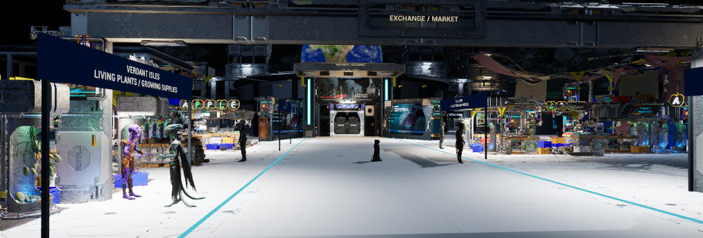
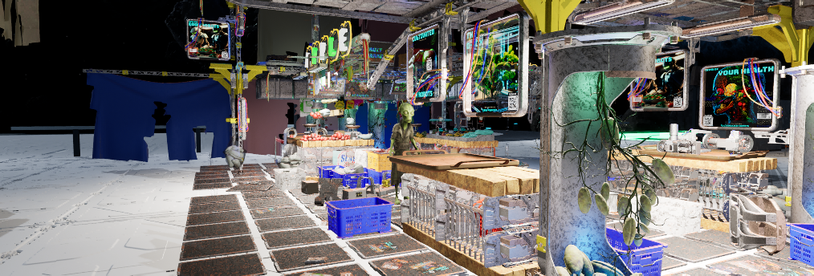
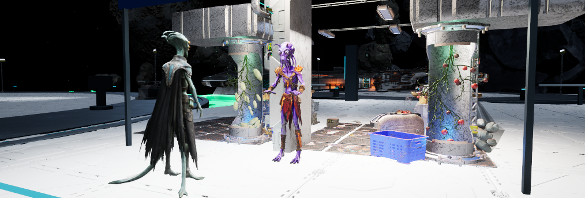
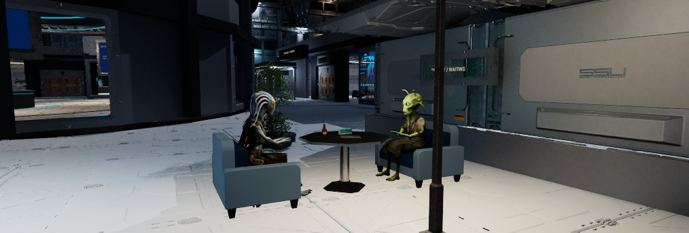
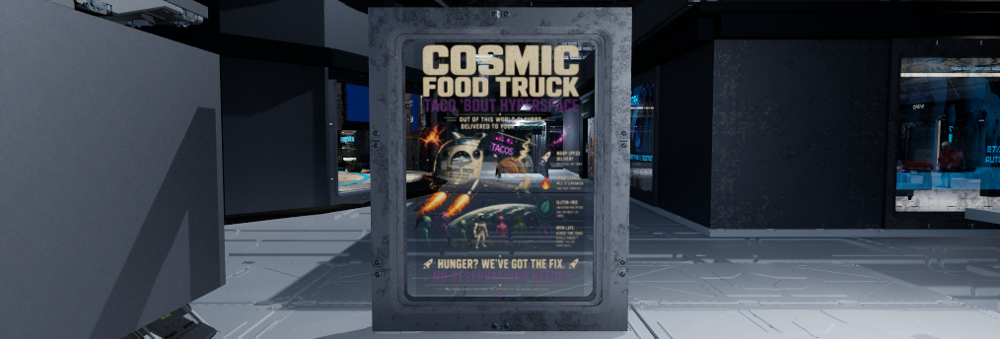
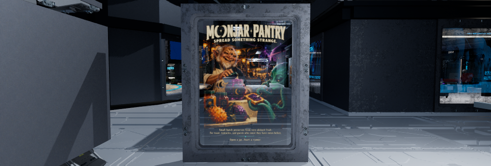
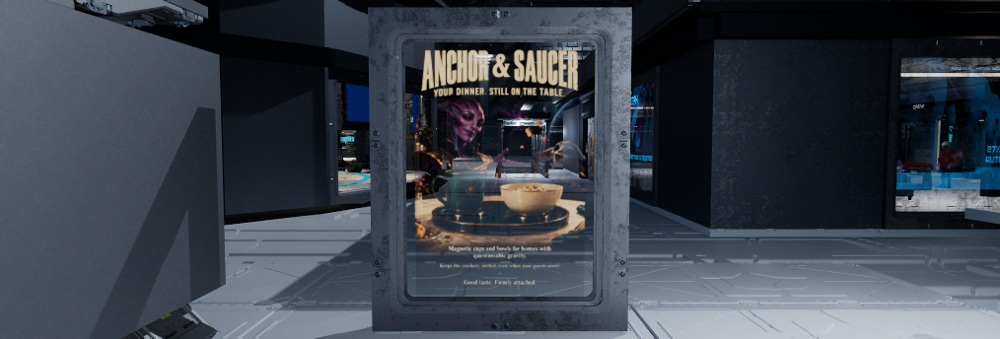
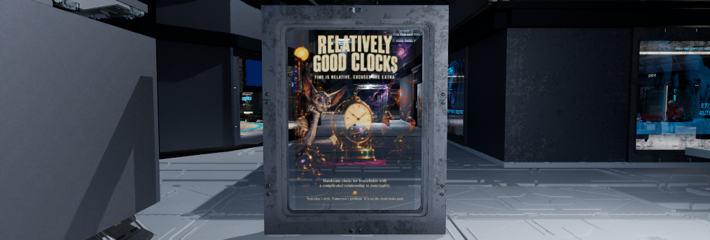
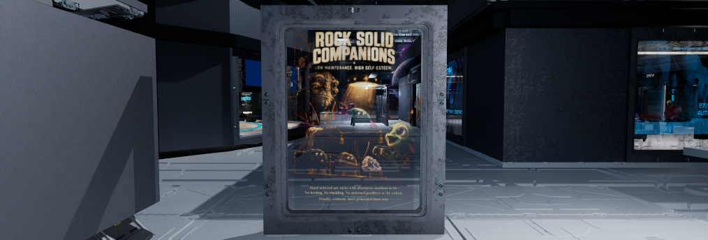

# October9 market atmosphere checkpoint

**PARTIAL / station finish goal remains active.** Saved and reloaded Wayfarer
candidate84 is `4bd636872ca8bce07cf1915cd0f187de8b5df57718d5f84d94cb1f5796b5629a`,
8,634 actors. This extends the [central/R checkpoint](2026-10-09-central-r-concept-detail.md).
It does not establish the central/R concept-quality target or finish the dock,
lounge, taller-cast cockpit, physical-input or performance work.

The three original P5 stall assemblies and Nova counter move closer to the
promenade as complete groups. Source meshes/materials remain intact. Four shop
headers share a quieter blue finish; eight competing old sign parts are hidden.
Robe, Glyph and Tribal remain vendors, with improved viewing positions. Covered
Olive and Seer replace two generic customer placements. Tendril and Robe sit at a
furnished table in the waiting pocket; twelve old mechanical-seat parts are
hidden/NoCollision. A real owned lamp and small local pool illuminate the group.
The courier follows the open centre strip. No vending interaction was added.

Two upright original P4 frames carry all five prepared market campaigns. A
private object-space material preserves complete portrait fit and adds slight
scan modulation, transparent dark areas and a narrow edge fade. Original frame
controls remain upright. Cosmic Tacos is the unmodified owner image; Moonjar
Pantry, Anchor & Saucer, Relatively Good Clocks and Rock Solid Companions are the
four previously prepared illustrations. No new image generation or source-art
editing occurred. Textures and original R display material remain unchanged.

## Native checks and retained failures

| Check | Result and limit |
| --- | --- |
| Reload85 | 8,634 actor snapshots unchanged at1e-5 numeric tolerance; identical saved map hash; clean map/content packages |
| Walk84c | 29/29 points,122.53m,40.28s; ordinary SSWalker movement/collision; original possession restored and temporary pawn destroyed |
| Earlier walks | Walk84 stopped at16/26 because a waypoint lay beyond the existing waiting wall. Walk84b stopped at22/26 at the existing arrivals gantry/cabinet. Actual blocking bounds were recorded; routes corrected, collision retained. Both test pawns cleaned up. |
| Furniture | New table/two armchairs retain the previously verified private simple BOX collision; all12 central/R/market furniture actors checked on reload |
| Cast | Eight sampled vendor/customer/seated/courier clips advance; courier moves405.35cm between samples. Grounded toe samples and inherited seated offsets checked. This is not continuous hand/cloth/sole certification. |
| Carousel85 | Five ordinary native frames show indices0,1,2,3,4 and the matching distinct illustrations in order;20-second dwell,0.6-second crossfade, second board40-second phase offset |
| First display attempt | ComponentMask input is `None` in installed5.8.3. Failed `Input` connection left a private partial graph; inspected/repaired in place before saving. First saved view exposed the back face; candidate84 rotates the complete hosts correctly. |
| Preservation | Source preview, tuning, Build55 DLL, owner layout, account/settings/suspend and ten pre-existing owner-edited files unchanged |

The saved scene retains the shared NPC-only head fill. Chosen models were
screened: no graphic nudity in these common-area placements; dancers excluded.
The low-resolution earlier source thumbnails alone were not final placement
evidence. Native poses above provide the current clothing/role review.

Existing `BP_Blinds` startup errors still make StartPIE report failure while the
real Survival/SSGameMode world is running; the world was verified before capture.
No retry-created second PIE session. The older GPU device-hung cause remains
unresolved. No new C++ changes/build,60FPS claim, cook, package upload or merge.

## Current saved images

These are **current saved candidate84**, ordinary1014x344 viewport captures.
Dock workers, lounge social finish and Phoenix fit are still unfinished. Cast
shown here uses the supplied normalized178cm variants. Images are copied
byte-for-byte; full capture receipts and failed trials remain private/local.

All five native ad phases, current saved candidate84

## Storage and source

`Scripts/RefineStationMarketAtmosphere.py` records the adopted guarded staging,
native graph correction and observed placement refinements. Do not replay it on
the current map. The original map backup and all native requests/results live
under `.agent/local/StationRefinement/Market82`; actual images/receipts are under
`.agent/local/Outpost/LiveOperationsPIEReview1_Market83`, `Market84` and
`MarketCycles85`. The [sanitized evidence](market-atmosphere-20261009/evidence.json)
pins hashes, native checks and unedited image copies.

Four new material packages under
`/Game/OutpostSandbox/StationRefinement/MarketAtmosphere83` remain private/local,
alongside the map, existing campaign textures and licensed kits/crew. GitHub
contains the recipe, documentation and review evidence, not a complete restore.
Published0.1.22-alpha/itch2048604/sourcee6c2a87 is unchanged. Continue dock work
under the active owner goal; PR69 remains draft/unmerged.
