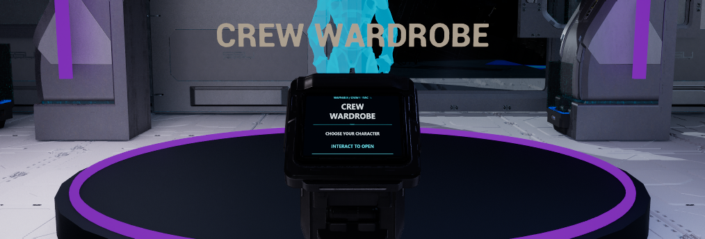
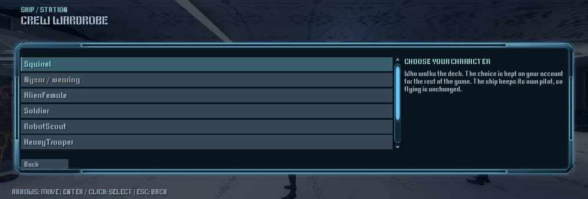
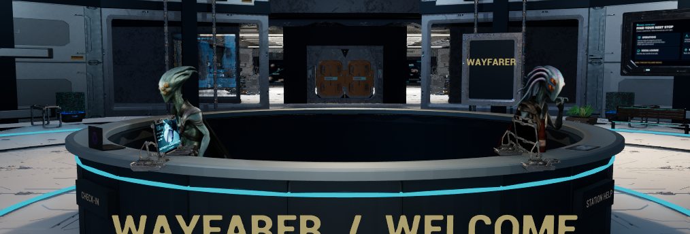
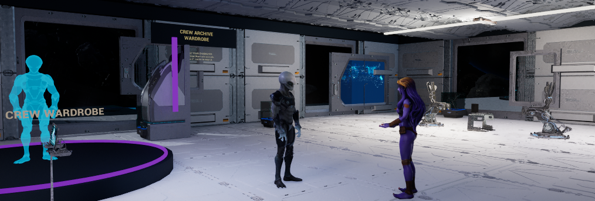
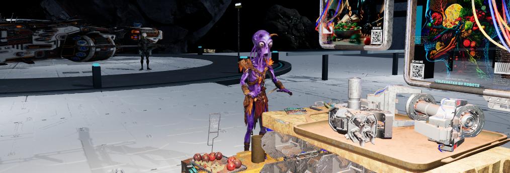
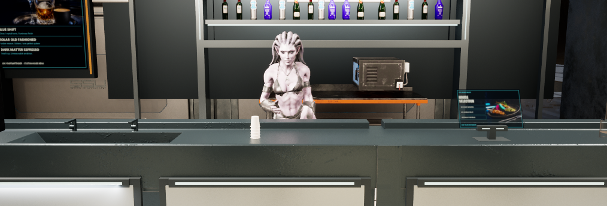
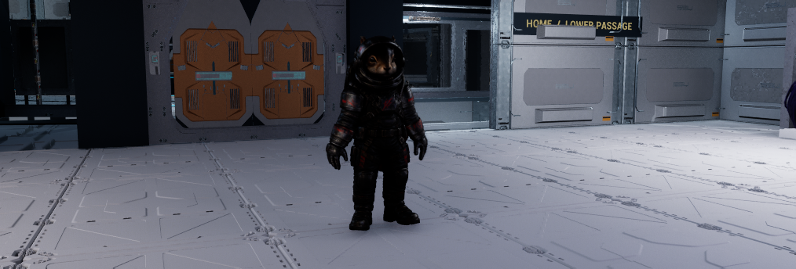

# October9 station crew, central/R and 178cm hero

Status: **implemented, saved/reloaded and ready for owner review; acceptance remains partial**.
Scope: finish the central/R presentation pass, replace ten existing cast slots with
the supplied non-dancer crew, assign one bartender/three outside merchants, and
adopt the supplied replacement hero at178cm. This supersedes the earlier NPC/hero
exclusions and female-bartender preservation request. T display selection remains
held. No new gameplay mechanics, dancers, cook, upload or merge.

## Delivery and verification boundaries

| Layer | Verified result |
| --- | --- |
| Source | `SSGameMode` startup correction, three guarded authoring helpers, original wardrobe SVG/PNG, existing Squirrel tuning row and documentation. |
| Loaded editor | Full Editor Build55 succeeds (10actions,28.11s), linked DLL `7b0ea67f`; one hidden UE5.8.3 editor. |
| Saved scene | Live Wayfarer `433d6de1`; Reload65 verifies8,490 actor identities, all ten cast assignments, eight persistent NoCollision prop profiles and retained wardrobe use point. PIE stopped; map/content dirty lists empty. |
| Native Play | Ten crew tick/advance clips; patrol/courier move. Real temporary SSWalker crosses central→R using native collision. Actual wardrobe Use opens the existing menu. |
| Visual review | Lead reviewed actual1014×344 Play images; final wardrobe text upright/readable. Images below carry their capture state. They do not establish every contact, full-room quality or owner acceptance. |
| Private content | Live map, crew, owned console, two new screen packages and17 hero packages remain local/ignored. A GitHub checkout alone cannot restore the full native project. |
| Published build | Unchanged0.1.22-alpha / itch2048604 / sourcee6c2a87. No new package or publication. |

## Crew and room changes

| Character | Existing job/placement | Animation purpose |
| --- | --- | --- |
| Seer | Reception check-in and support | Idle, talk and greeting |
| Tendril | Reception welcome/directions | Listening, pointing and talk |
| Olive | Unarmed station security | Alert idle/greeting and existing patrol route |
| Robe | Outside merchant A | Bartering/pitch/talk |
| Glyph | Outside merchant B | Bartering/pitch/confirmation |
| Tribal | Third outside merchant, behind south stall | Bartering/talk/greeting |
| Warden | Equipment inspection | Worker idle/looking |
| Crest | Market service circuit | Existing walking route/worker idle |
| Dread | Bartender | Compatible BarBartender_Type02 clip |
| Amethyst | R wardrobe visitor | Listening/talk/confirmation with guide |

`Scripts/IntegrateStationCrew.py` preserves stable actors/routes and source assets,
checks exact Skeleton identity for each selected clip, clears old material
overrides and uses supplied178cm/sole0 meshes at unit scale. All ten reuse the
40lm/100cm shared head fill with shadows, specular, GI and reflection contribution
disabled. Lighting normalization is not a measurement of every animated face.
Tribal's final placement is(-520,-1665,85),yaw90. New custom NPC behaviors/voice
generation were not added; these are existing role and route systems.

`Scripts/RefineStationCentralR.py` reduces the two reception consoles from0.6 to0.42,
adds forms/water and caps the pen mesh at14cm. In R it retains four waiting chairs,
replaces two table projections with tablets/books, positions the consultation pair
face-to-face and reduces ceiling/task glare. Original white floor/source materials,
central information boards and central's1–2-ad maximum remain.

R now uses the complete owned `Sci_fi_Console_Game`, front facing the approach,
with the existing Crew Wardrobe service actor preserved. Its private screen reads
"Choose your character / Interact to open"; wall guidance describes actual immediate
selection behavior. The source artwork is original deterministic SVG/PNG in
`ContentSource/WardrobeConsole`, without modifying supplied ad art. The private
material flips V and applies emissive gain8 to fit the console's native monitor UVs.
The SVG generator and Git checkout use LF explicitly so the source-manifest hash
is reproducible on Windows; the PNG used by Unreal is unchanged by this text fix.

## Startup defect and native checks

Before the fix, all ten placed actors had disabled tick and animation time0; route
actors stood still. Synchronous station streaming inside `ASSGameMode::BeginPlay`
occurred during the initial BeginPlay dispatch. `StartPlay` now calls
`Super::StartPlay` first, then performs the existing hangar/title/authoring-entry
block; tuning/audio/world initialization stays in BeginPlay. Fresh Build55 boot
and `Runtime56.json` confirm all ten advance and both routes move. This is a
targeted lifecycle correction, not a full menu/save/flight regression pass.

The replacement source handoff is
`.agent/local/CharacterAssets/HeroSquirrel_20261008/Delivery_RedStreaks`.
All17 already-derived packages (68,021,764bytes) match their copy manifest under
`/Game/SpaceSurvival/Licensed/HeroReplacement178`. The69-bone mesh retains supplied
art/materials and has169,599 triangles/12,102 fur cards. Only the existing Squirrel
row changes:178cm fit, scale1, sole0, eight compatible clips, derived pilot offset,
gait speeds and seven tail envelopes. Native walker and ship pilot load that mesh.
No current-account wardrobe selection was forced.

`HeroPassage60.json` retains31 samples of a temporary real SSWalker, possessed by
the actual controller. Native movement input at320cm/s traverses the central→R
doorway from(4200,1300,90.15) to y3102.47, with idle/jog/idle observed. Capsule
half-height88cm, original pawn possession restored, temporary pawn destroyed.
This used scripted movement input, not physical keyboard/controller operation.

`WardrobeUse64.json` records the actual terminal's native Use returning success
and the displayed Crew Wardrobe menu. The temporary test position/view was restored,
Nyxar stayed equipped, no selection/purchase occurred, and the account/settings/
suspend save hashes match the capture baseline. Reload65 then reloads the saved
map and rechecks cast, poses, props, service target, screen binding and hero assets.

## Labeled review images

**Current saved scene, Build55, capture64:** final wardrobe console and screen.
Full-room acceptance, continuous contact and performance are unfinished.

**Unsaved interaction test in the saved scene, Build55:** native Use opens the real
menu. Nyxar remains wearing; Squirrel is available. No appearance was selected.

**Older saved comparison, capture60:** reception's final staff/desk dressing; the
later wardrobe screen changes are not present in this snapshot. Continuous hand
contact and owner approval remain unfinished.

**Older saved comparison, capture60:** R consultation/waiting layout. The skinny
console visible at left was subsequently replaced by the complete console above.

**Older saved comparison, capture61:** third outside merchant behind the south
stall. This placement is retained in Reload65; hand/prop contact is unfinished.

**Older saved comparison, capture58:** Dread's bartender assignment, retained in
Reload65. Compatible motion advances; a held drink/pour/grip is not verified.

**Unsaved temporary possessed hero in saved map, capture62:** supplied178cm Squirrel
mesh/animations. Test pawn was removed and original Nyxar possession restored.
Face readability, continuous tail/sole contact and cockpit fit need further review.

All PNGs are byte-identical copies; `station-crew-20261009/manifest.json` binds
source/capture state and SHA256. No screenshot retouching or viewport/quality changes.

## Receipts and protection

Private receipts reside in `.agent/local/StationRefinement/Crew52`; capture manifests
reside in `.agent/local/Outpost/LiveOperationsPIEReview1_*`.

| Saved artifact | SHA256 |
| --- | --- |
| Live Wayfarer | `433d6de1e3b02e72343ef050ee2827ba5a175917eabaaf76ad389e0e105ff371` |
| DA_Phase1 | `559cbf22bb8bf3e62261a2835c7667fd7485e1dfb8f0dfe852fb8a95a40ba8a3` |
| Wardrobe material | `1562fc478c9dd3c00fe03adaa67c23331d465ba77183de4ae6b810162ca0def8` |
| Wardrobe texture | `7501c10fe41025e379728bf6d222845747870f1d923650765103aa9cc1e56545` |
| Build55 DLL | `7b0ea67fa5d6838908cacacba30af45ce3f983d5bb4a53fc75fc8d99b2ca917a` |
| Preserved owner preview | `e7958758a861d17fe189601b17b486db9ea75086080a8e1b5f17e56cbb7b18db` |
| Preserved owner EditorLayout | `29f155870eed67b6c98987b61fb5dc547bd010dda90c863ccd1a4fbe53a43d7d` |

Original map `e3ed61ba` is backed up as `L_WayfarerRuntime.before.umap`; later
bounded map backups precede each pass. `Hero178Adoption57` retains the complete old
DA_Phase1 and before/after Squirrel row. `Hero178Copied.json`, `Runtime56.json`,
`HeroPassage60.json`, `WardrobeUse64.json`, `Reload65.json` and capture64's finalized
manifest are the detailed evidence. Other owner asset/project edits stay unstaged.

Failures are retained: original editor GPU crash preceded these edits; initial
offscreen startup needed a private layout; the first pen scale was excessive;
one merchant camera was blocked by a planter; first console angle showed its back;
capture63 screen was upside down. Corrections are in the labeled later receipts.
UE5.8 TextureSample accepts the `UVs` input; an initial `Coordinates` connection
failed, then the existing partial graph was inspected/completed without duplicate
creation. Capture completion alone never certified visual quality.

## Checks and remaining work

- Full Editor Build55: **PASS**. Existing newer-MSVC, Tripo Interchange dependency,
  engine deprecation and SSHUDRefresh font deprecation warnings remain; no new
  compile error. `BP_Blinds` Accessed None still appears on Play startup; actual
  world state was checked instead of blindly retrying the false failure response.
- Structural check42, Python compileall, source asset validation26meshes/17WAV,
  changed-C++ native clang-format, documentation gate and diff whitespace: **PASS**.
  No new domain logic; portable domain suite and full Phase1 suite not rerun.
- Native reload65, ten-cast compatibility/readback, exact hero package hashes,
  central→R passage, wardrobe menu and capture/settings/save preservation: **PASS**
  within the described scripted scope.
- Lead follow-ups remain in [KNOWN_ISSUES](../KNOWN_ISSUES.md): physical inputs,
  hero stairs/cockpit/pilot/tail/sole fit, complete staff hand/prop contact,
  representative frame-time/VRAM and GPU-crash diagnosis. The heavier fur delivery
  and newly active crew invalidate frozen-scene performance assumptions.
- Owner next reviews central/R layout, cast and height together. T remains held;
  Phase1, new package,60FPS and owner visual acceptance are not claimed.
