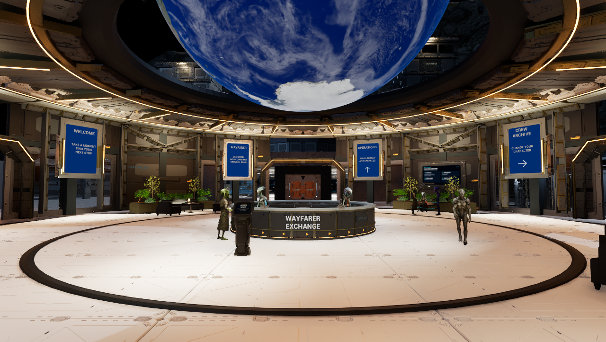
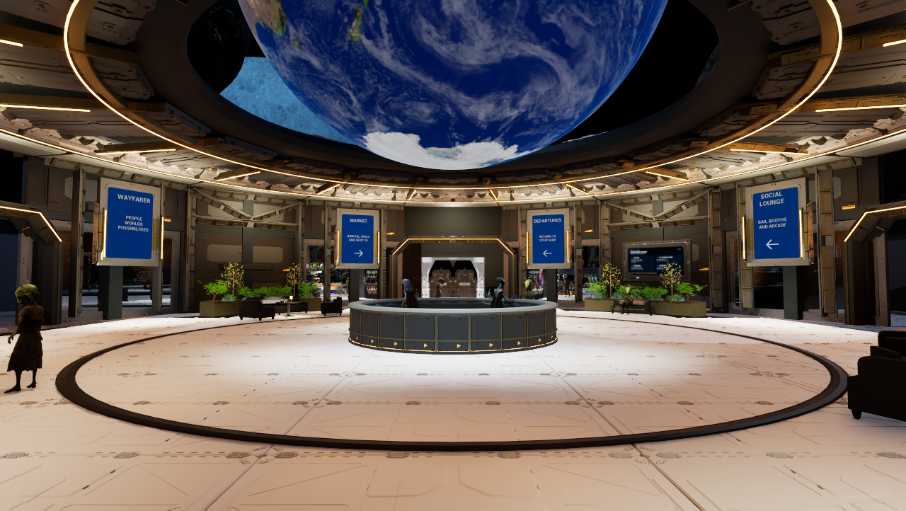
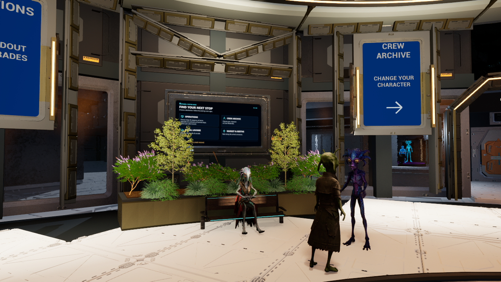

# Central wall detail and planting

October10,2026: saved188 adds20 inner portal frame members and24 wall braces/headers from the existing Genesis kit. It lowers/narrows44 plants to open the directory centers. No new material or vendor asset is created; floors, lights, services, original furniture and NPCs are unchanged. The fixed target-v2 remains unchanged.

Current Wayfarer has9,102 actors, SHA `2a42ccb9f550fc4265d57c1ad5643787375ff5be3236e1cc7cdb4edf0fc493a5`. All9,014 untouched existing snapshots matched before save;404 protected source/asset/owner files remain unchanged. Reload190 verifies all88 changed/added Central actors and the seven apartment additions, with no scoped deltas, clean packages and ray tracing0. The offscreen editor is closed.

## Native views and limits

Three ordinary1280x722 Play views use the earlier107 camera positions/angles. The wall framing reads more deeply and the center of the directories is less obstructed. Side trees still overlap some screen content; remaining wall, planting and fixture/material refinement keeps the complete concept target open. These are unedited game captures, not regenerated concepts.

Capture189 completed all three images and restored HUD, original view, viewport, quality and temporary camera; map bytes and dirty-package lists matched. **Its overall preservation gate failed:** the settings save changed during Play. Account and suspended-game files stayed unchanged. The cause is unconfirmed; the resulting settings were archived without overwrite or reset, and the owner was asked whether changes were intentional. Read-only attempts did not recover a verified earlier copy. No all-saves-preserved or overall capture-pass claim. Further Play review waits on resolving this ownership question and must preserve a byte backup before launch.

Private map before/after snapshots and full receipts remain under `.agent/local/StationRefinement/CentralDetail187`; sanitized [evidence](2026-10-10-central-detail-evidence.json), images and the guarded historical recipe are tracked. Build55/release are unchanged; no C++ rebuild, cook, deployment or merge. Point-clearance and earlier walks are separate evidence, not a new continuous walk for this pass. Central fixed-v2 and Room R remain lead-owned work in [KNOWN_ISSUES](../KNOWN_ISSUES.md).
