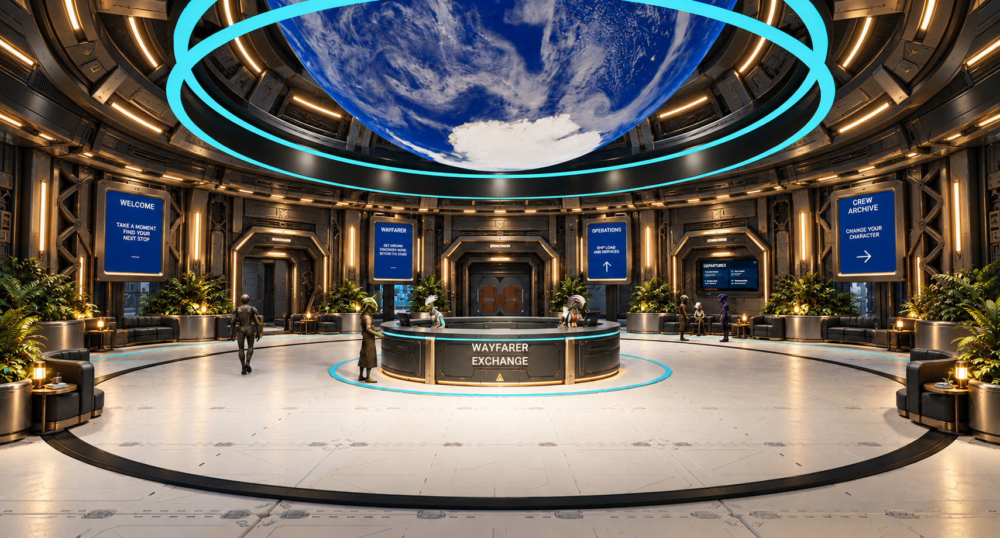
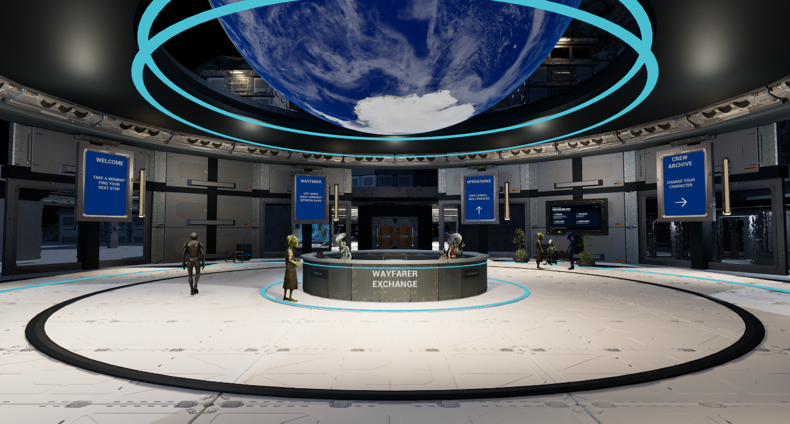
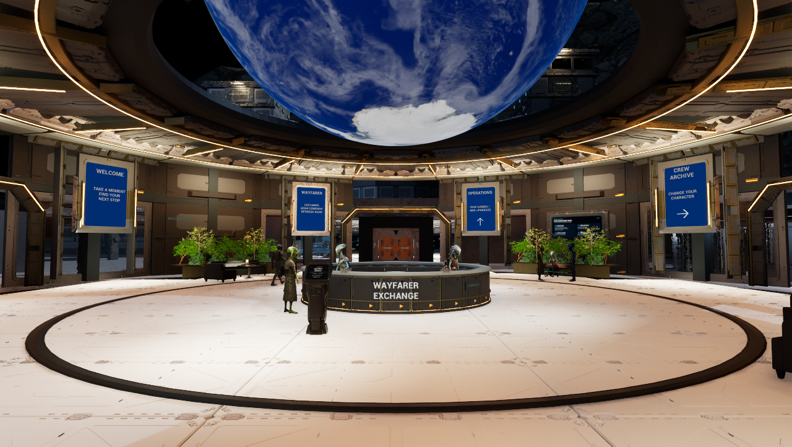
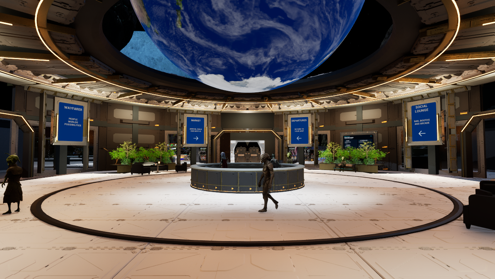
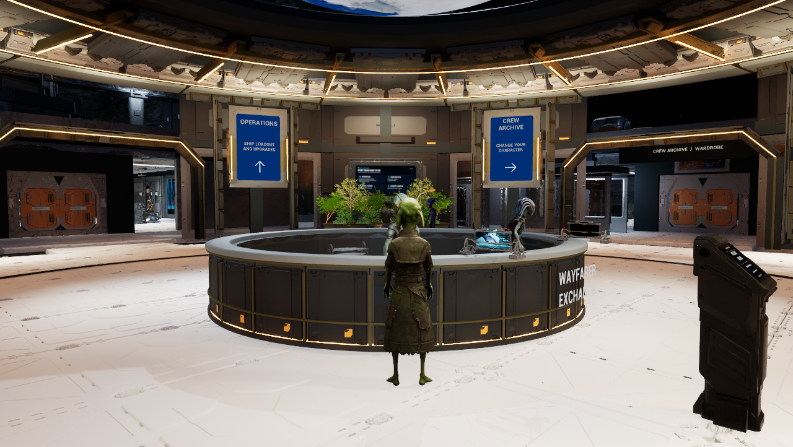
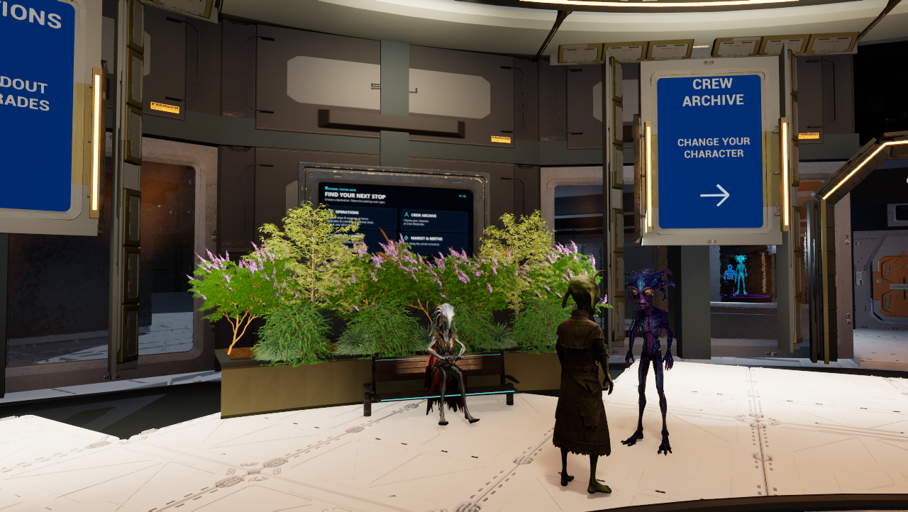
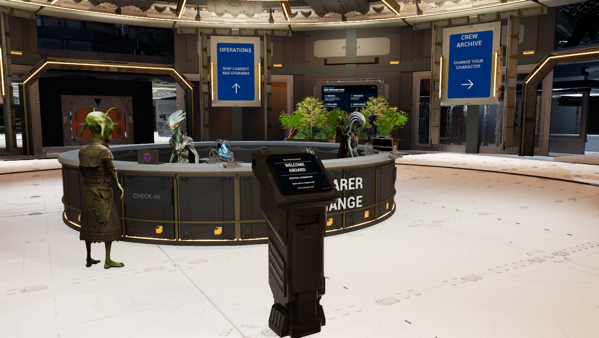
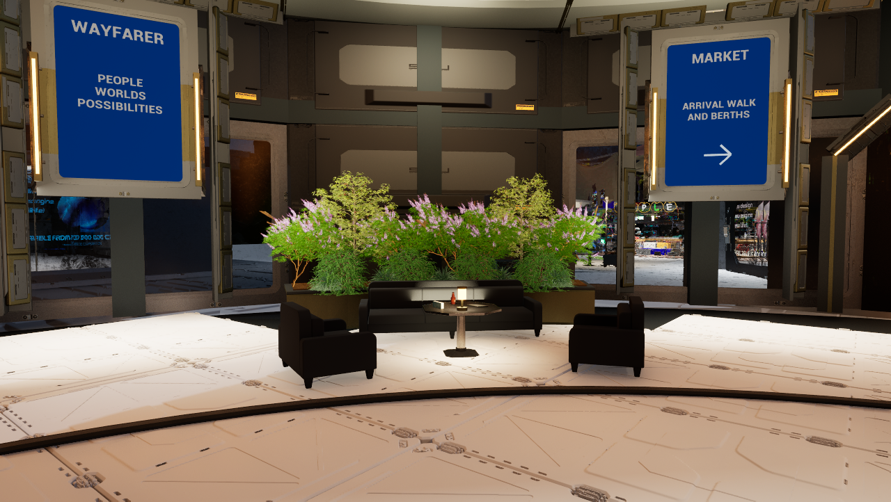

# Central hub concept implementation — October 10, 2026

The owner requested a fresh target inspired by the existing room, then stronger
architectural features. Target-v2 is now the fixed benchmark. Later instructions
add the existing kiosk as a check-in podium, more reception detail, remove the
flat cyan circles and improve actual room lighting. The target image was not
regenerated after those instructions. R remains second; other rooms, cockpit and
NPC repairs are held. Visual owner acceptance remains open. Native work is paused
for VRAM availability; the offscreen editor is closed while source checks and
documentation continue. This checkpoint does not establish a full target match.

## Saved native result

Wayfarer map `52a5ee747fe7a586029c9f2ad85d782972b22c61b60bfbfcc9f7c88387dafdc7` has 9,051 actors, 401 more than baseline97.
The existing circular footprint, four doors, white low-gloss floor, directions,
staff and services remain. The pass adds a segmented two-tier ceiling and warm
radial seams, four chamfered portal surrounds, mechanical wall framing, four
curved planted banks, two sofas/four armchairs/tables, detailed reception fascias
and the complete owned `SM_Sci_fi_Console_Game` podium. Its original screen source
is factual reception information; no new check-in mechanic is implied.

Green Acer, flowering Vitex, Abelia and Ophiopogon from the already-installed
Nanite Plants Sample Collection provide layered planting. No plant generator or
new pack import was needed. The five broad cyan circle actors are hidden, with
their source assets retained. Only Central lights/material assignments change;
the floor material and global exposure/quality stay intact. Narrow warm fixtures,
wall/ceiling fill and weaker overlapping floor pools improve legibility. Six new
seats use a private neutral fabric finish, retaining source normal/AO detail.

## Images and target provenance

The target is a built-in ImageGen concept, not gameplay. Its full prompt is
[preserved](images/2026-10-10-central-hub/Central-hub-target-v2-prompt.txt).
The owner's later changes intentionally override its cyan circles and add the
podium. All native images below are ordinary 1,280×722 Play in Editor captures;
no grading, compositing or image enhancement was applied. The older baseline is
1,280×688. The offscreen review window was resized after repeated PIE launches
reduced its height; this changes framing, not scene exposure or scalability.

## Verification and retained failures

- Native movement input: 30/30 waypoints, 165.28m, through all four
  entrances and the podium approach. Actual SSWalker collision remains enabled;
  original possession/view restored and temporary pawn destroyed. This is
  scripted input, not physical keyboard/controller testing. Initial Walk103
  blocked at waypoint19 when its diagonal crossed the new seating group; the
  route moved into the aisle, without moving furniture or disabling collision.
- Twelve hidden planter collision supports, two sofa collision copies and the
  podium are saved with BlockAll and simple collision. The final 17 ceiling
  seam actors are above six metres and have no collision; they do not alter the
  passing walking route.
- Prior Reload105: all9,034 actor snapshots matched within1e-5. The final17
  ceiling seam actors have not yet received a fresh native reload. At shutdown,
  PIE stopped and map/content packages were clean; the offscreen editor exited.
  CPU readback confirms saved107 map bytes, all40 private package hashes and
  all six image hashes. All78 protected content, binary, save and owner-edit
  files match the startup record. The owner's normal
  layout changed while their visible editor was open/closing at03:01:45UTC;
  it was retained, not restored over their change, and is unchanged from the
  later readback and shutdown. Strict Reload105 therefore records a layout
  mismatch instead of an unconditional preservation pass. No final107 native
  reload or full world-equality claim is made.
- Capture107 stored all six images, HUD/view/quality restoration and temporary
  camera destruction. Its finalizer was called with a shortened run ID during
  shutdown and correctly rejected the call. The original manifest and failed
  receipt remain intact; post-shutdown image, map and save hashes were checked
  independently. This is not a claim that the finalizer passed.
- A CPU geometry check found16 inconsistently oriented boundary edges on each
  of the three original planter meshes. The source generator now reverses the
  end caps correctly: all six generated meshes have zero open/nonmanifold edges,
  zero inconsistent winding and zero degenerate triangles. Vertex positions and
  UVs are unchanged; the three full rings are byte-identical. The three corrected
  planter meshes are prepared only; native import and visual verification wait
  until the VRAM pause ends. Current screenshots precede that correction.
- The unrelated crew-normalization validator reports `Unnormalized height/sole:
  Warden`. No NPC asset or normalization repair was made; the owner's held NPC
  scope remains intact. This is retained as a failed supplementary check.
- Earlier native reviews exposed bare-branch selection, yellow leaf transmission,
  bright inherited surfaces and seating color. Corrections and failed attempts
  remain in private receipts; current images supersede them. An initial kiosk
  material property failure rolled actors back; its two partial private assets
  were inspected before an explicit bounded graph repair.
- Python compilation,42 source structural checks and the content-source validator
  (26 meshes,17 WAVs) pass. Repository/PR documentation and whitespace gates are
  checked with the final source commit. No C++ changed, so Build55 remains the
  existing binary; no new C++ build, cook or package is claimed.

## Existing advertising artwork

The owner clarified that advertising needs a futuristic display, which can be
holographic glass; it does not require a conventional television. A CPU-only
readback confirms all five selected images for each of T, R, Market and L, plus
the two Central options (Alien Fix-It and Probe Support), remain saved and match
their recorded hashes. All16 original reuploads and their earlier identical
uploads also match. Aspect variants do not increase campaign counts. No art
generation or image editing was needed. These are local artwork checks, separate
from current native display placement, complete cycling and room acceptance.
The [original source-set receipt](2026-10-07-room-ad-source-sets.md) retains the
campaign provenance; current priorities remain in KNOWN_ISSUES.

## Reproducibility and storage

The four adopted source recipes are `RefineStationCentralArchitecture.py`,
`RefineStationCentralFeatures.py`, `RefineStationCentralCheckIn.py` and
`RefineStationCentralLightGarden.py` under `Scripts/`. They are bounded authoring
history, not idempotent scene generators. Never replay their apply/correction
stages on the adopted map. `geometry()` emits six original closed modular OBJ
sections; its corrected planter end caps are the sole pending native source
change at this checkpoint. Screen SVG/PNG/generator and hashes are under
`ContentSource/CentralCheckIn`. The four native derivative folders end in
CentralArchitecture97, CentralFeatures99, CentralCheckIn100 and
CentralLightGarden101; their40 package hashes and image hashes are in the
[evidence record](2026-10-10-central-hub-evidence.json).

The current map, licensed kits and native derivatives remain local; GitHub is
not a full native backup. Existing Build55 and published0.1.22-alpha/itch2048604
are unchanged. No cook, upload or merge. Physical input, representative
performance, held NPC defects and overall Phase1 acceptance remain unverified.
The sole active acceptance/follow-up log is [KNOWN_ISSUES](../KNOWN_ISSUES.md).
