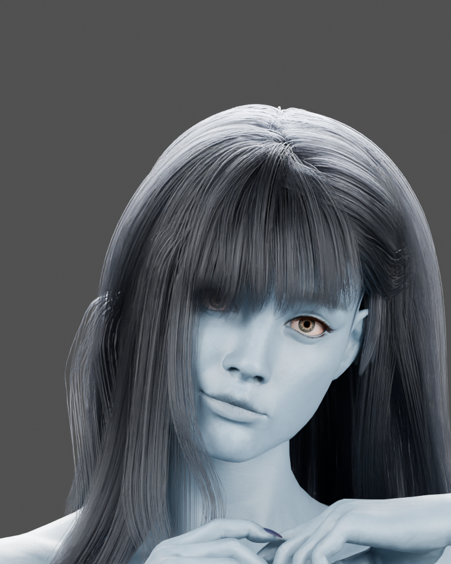

# Joy light-blue and Central planter CPU checkpoint

October10,2026,05:19UTC. **PARTIAL: assets saved and CPU checks passed; native
visual review is pending.** The owner explicitly limited work to CPU after the
one-hour VRAM pause. No rendered Unreal session was reopened; the one-time
resume follow-up was disabled. Central's fixed target-v2 remains unchanged.

## Saved result

Joy now has a private light-blue derivative, retaining her original geometry,
shape keys, fitted hairstyle, eyes and costume. Four skin materials preserve
existing albedo/normal detail with linear tint `[0.46,0.66,0.84]`. The existing
dark hair base remains; the purple streak uses `[0.008,0.009,0.012]`.

All135 current Cyborg clips were retargeted from the crew skeleton onto Joy's
existing101-bone CC skeleton:16 base and119 role clips, including the six pole
clips. Twenty-one mapped chains cover torso, head, limbs, toes and fingers.
Separate leg goals/limb solvers and the aligned retarget pose are saved. Two
groom bindings and `BP_JoyLightBlue_Review` are saved with a looping Idle.
No new character was placed in the station and no AI behavior was added.

The147 native packages live in
`/Game/SpaceSurvival/Licensed/StationAssets/JoyLightBlue117`. The old JoyPurple
and current Cyborg sources remain unchanged. The donor is `Cyborg/Rig/SK_Cyborg`;
the historical `Cyborg/Mesh/SK_Cyborg` location was stale.

This768×960 image is an actual Cycles CPU render from the color derivative,
using the source scene lighting. It is not an Unreal screenshot, final hair
shading approval or a face redesign. Bright studio highlights remain visible.

## Verification and limitations

- Source pair is owner-confirmed: `Cyborg_Claude/rig/Cyborg_new.blend` and
  `JoySkinPreview_20261008/selected_deep_purple/Joy_Purple_HairFitted.blend`.
  Both original hashes remain unchanged. The Blender derivative preserves
  mesh coordinates, shape keys and armature rest matrices byte-for-byte in
  the recorded geometry digest. Original native64 Joy packages and135 donor
  animation packages retain their hashes.
- All135 target clips preserve source frame count, duration and root-motion
  enable flag. Four sampled times per clip check finite transforms of hip,
  head, hands and feet. Source and target motion agree as animated for133;
  LookL/LookR are static at those sampled frames in both sources and targets.
  These are sampled structural checks, not continuous motion/contact review.
- A fresh NullRHI process reloads all147 Joy packages; confirms four blue skin
  overrides,18 material slots, original skeleton,135 clip durations/frame
  counts, compiled preview Blueprint/Idle settings and two saved bindings to
  the correct target mesh/grooms.350 checked files preserve their recorded
  hashes and the process ends with zero dirty map/content packages. Blueprint
  template attachment pointers are not runtime groom-follow evidence.
- Three Central planter body/soil/lip meshes now contain the previously
  prepared cap-winding repair. Exact40-package/map guards and three backups
  preceded replacement. Bounds/material slots and the other37 Central
  packages are unchanged. The three repaired meshes pass fresh asset reload.
  Wayfarer map bytes remain `52a5ee74` (9,051 actors from saved107). The prior
  six Central pictures predate this repair; a final world reload is still open.
- Inspection114/115 retained stale-path/Python-property failures. Complete118
  stopped when LookL proved still; its six saved clips were inspected before
  continuation. Complete120 stopped before mutation on a package/object-path
  hash-key mismatch. Complete121 normalized keys and compared source motion.
  Read-only122/123 failures came from Python property access and duplicate
  Blueprint handles;124 uses reflected properties/unique paths and passes.
  None of these failures was erased or treated as successful verification.
- Nonfatal logs retain optional-curve absence, imported-animation dependency
  and deprecated registry-access warnings. No curve-preservation, zero-warning,
  runtime groom simulation or animation-intersection pass is claimed. Original
  donor review already notes some arm/body intersections. Blender's thumbnail
  permission/quit allocator warnings did not prevent the verified save/render.

## CI follow-up

At4547eea, [documentation CI](https://github.com/j6sistek-ui/SpaceSurvival/actions/runs/38027457803)
and the [strict domain/core/sanitizer job](https://github.com/j6sistek-ui/SpaceSurvival/actions/runs/38027456203)
pass. Source identity, fresh Git export, Python syntax and station-recipe tests
also pass. The same source workflow fails `CheckCookCoverage.py` on these five
pre-existing string references:

- `/Game/ImportedLibrary/Portal/NS1_Portals/NS_NS1_TeleportPortal.NS_NS1_TeleportPortal`
- `/Game/NiagaraExamples/FX_Player/NS_Player_Teleport_In.NS_Player_Teleport_In`
- `/Game/NiagaraExamples/FX_Player/NS_Player_Teleport_Out.NS_Player_Teleport_Out`
- `/Game/OutpostSandbox/Materials/M_OutpostGraphite.M_OutpostGraphite`
- `/Game/P1toP5_Bundle/P4_Genesis_Vol1/Meshes/SM_Door300X250_V1_Part1.`

The priorf5a2008 [source run](https://github.com/j6sistek-ui/SpaceSurvival/actions/runs/38022926288)
has the identical five failures. Source/config/checker/workflow inputs have no
diff across the CPU checkpoint. Local reproduction reports37 cook roots,
one excluded directory,14 excluded packages,152 string paths/five uncovered.
The later release-payload/format/whitespace CI steps were skipped; local
whitespace passed separately. No exclusions or cook roots were changed to
silence this held ship/portal prerequisite. Whole-PR CI is not green.

## Source and storage

[Sanitized hash evidence](2026-10-10-joy-blue-cpu-evidence.json) covers all147
private packages, clips, three repaired meshes and preview. Historical guarded
recipes are under `Scripts/StationRecipes/CpuJoy121`; only path constants differ
from executed source, verified by AST comparison. Do not replay their adopted
creation steps. Original scenes remain at the owner-confirmed M: locations;
native assets remain under Content. The Blender derivative, backups, input
geometry and complete receipts/logs are preserved privately under
`.agent/local/StationRefinement/CpuJoy121`.
GitHub contains recipes/evidence/head preview, not a full private asset backup.

PASS: Python compilation of Scripts/ContentSource,42 structural checks,
source-format validation of26 meshes/17 WAVs/unchanged GLB, repository/ready-PR
documentation declarations and whitespace checks. No C++ changed, so no new Editor binary was built;
Build55 and published0.1.22-alpha/itch2048604 remain unchanged. No cook, release,
merge, owner acceptance or finished Central/R claim. Lead-owned next work is
native visual motion/hair/contact review and Central composition when the owner
releases GPU use; then R. [KNOWN_ISSUES](../KNOWN_ISSUES.md) remains the sole queue.
