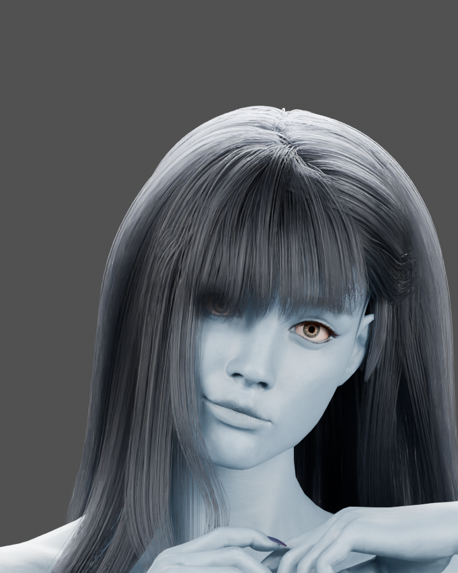

# Joy hair cleanup and initial station memory measurement

October10,2026. The protruding left-side loop is removed from the saved light-blue
Blender derivative and the Unreal review Blueprint. Ray tracing stays OFF by owner
instruction. The future target is 4K60 or1440p90+ with maximum ray tracing and no
frame generation; this is a target, not a measured result. Quality/design remains
the priority; visible compromises require the owner's decision.

## Change and verification

Only guide bundles10,12,13 of `2.side left 2` are filtered by a reversible first
Geometry Nodes modifier. All raw guides remain recoverable. The eight other hair
groups, body, shape keys, rig and material values are unchanged. The affected group
drops1173→1020 evaluated strands; the native base groom drops10976→10823 strands.
The original owner-confirmed Joy and Cyborg Blender sources remain untouched.

Fresh Blender reload verifies the body/shape-key/rest-rig digest and all raw hair
and material values, then produces this768×960 Cycles CPU preview. The corrected
base groom and binding are saved; only the base hair component of
`JoyLightBlue117/BP_JoyLightBlue_Review` changes. Its streak binding/material,
body mesh, looping Idle and all135 retargeted clips are preserved. Two new packages
bring the private Joy set to149;402 of403 prior guarded files are unchanged.

A fresh offscreen editor loads the saved assets, returns to normal ticks, then
verifies10823 render roots/1082 guide roots, original groom settings, BP references,
149 registered packages and405 file hashes. No build/reimport/save occurs in this
reload. Dirty map/content lists are empty. The station map remains52a5ee74 with
9051 loaded actors. This is a saved-asset/world-load check, not the pending full
actor-state, rendered composition, continuous groom/animation or contact review.

Retained failures: diagnostic134 and137 did not fully clean the tuft;138 did.
Native141/145 encountered Python property/value-wrapper issues;142 lacked the
Alembic hair importer;143 and subsequent immediate binding probes observed data
before deferred postprocessing. NullRHI156 and immediate rendered157 also saw zero
counts. After normal editor ticks,158 populated the saved binding without rebuild;
159 passed. The empty-editor launch hit the known Nwiro tab startup crash; the
working private layout under the repo restored the bounded offscreen verification.
No failed check was discarded or relabeled a pass. Both final editors closed cleanly.

## Initial station baseline

The read-only editor inventory finds149 skeletal-mesh components using36 unique
meshes, each with one LOD. Their instance-weighted LOD0 total is2,296,189 vertices;
that is potential scene geometry, not a per-frame visible count or a count of NPCs.
No GroomComponents are placed in this saved station. Joy remains a review asset.
There are476 lights:374 visible with nonzero intensity, of which25 cast shadows.

System-wide VRAM was2313MiB before launch and11099–11146MiB after warming with the
station and asset checks; it returned to2830MiB after the first clean exit. This
delta includes the editor, verification assets and other apps. The separate RHI
report lists7210.35MB of tracked resources, including528MB Nanite cluster data and
512MB virtual-shadow physical pages. These measurements are not interchangeable
and do not establish pure NPC cost, a leak, required packaged-game VRAM or FPS.
The runtime ray-tracing master was0; scalability observations were tier3. No
quality, lights, texture pool, population or render settings were changed.

Next performance work: capture representative frame times and visibility at the
chosen resolution, then assess distance LODs and animation update budgets while
preserving close-up appearance. Check light overlap, texture residency and shader
stalls from measurements. Do not infer equivalent FPS between resolutions or use
upscaling/frame generation to claim the requested baseline.

## Storage and open work

[Sanitized evidence](2026-10-10-joy-hair-and-memory-evidence.json) records hashes,
counts and recipe provenance. `Scripts/StationRecipes/JoyHair139` contains guarded
historical source; never replay adopted stages. The private archive holds Blender,
ABC, three saved native packages, before-BP/binding backups, receipts and logs.
Originals remain at owner-confirmed locations. GitHub is not a full native backup.

Native hair shading/continuous motion remains pending. Central fixed target-v2
and R remain unfinished; other rooms/cockpit/NPC repairs stay held. The earlier
five-path cook-coverage CI failure remains a separate release prerequisite.
No C++ changed; the BP compiled during adoption. Existing Build55/release are
unchanged. No cook, release or merge. PASS: six Python recipes compile,42 structural checks, repository and prepared
ready-PR documentation checks, and whitespace validation. The first PR-event
preparation used the Windows default text encoding; explicit UTF-8 fixed the
event fixture without changing the PR body. These source checks do not establish
a green whole-PR CI or native continuous-motion result. For current work, [KNOWN_ISSUES](../KNOWN_ISSUES.md) is the active queue.
