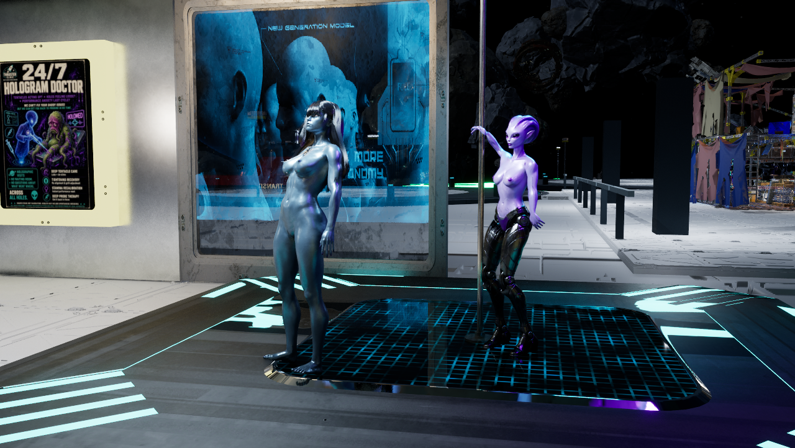
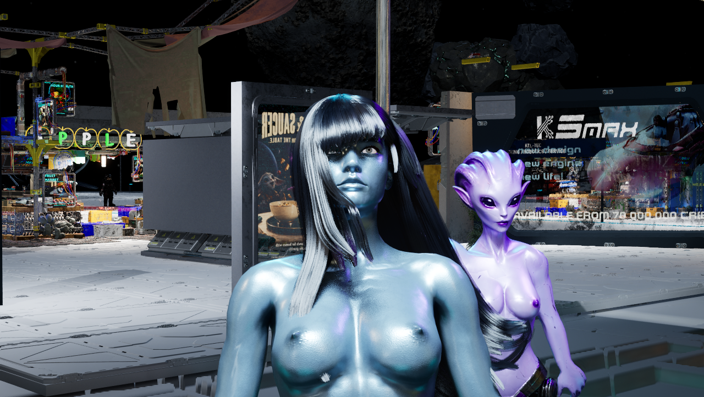
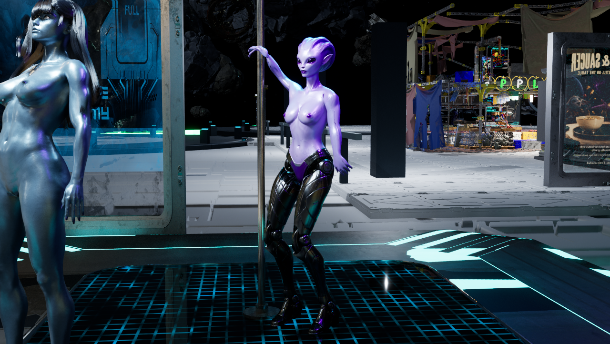
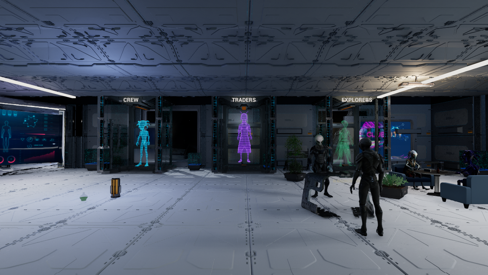

# R housings, Joy finish and first Cyborg pole loop — October 10, 2026

The saved R stage now uses the existing rigged Cyborg with the existing four-second PoleHipCircle animation, aligned to the polished pole and looping. Joy stands beside the pole in her existing Idle while the first dancer is checked. Her four blue skin materials use Metallic0.75 and Roughness0.32; blue tint, diffuse/normal texture detail, face/body mesh and hair identity remain intact. Three local canopy lights add a readable front key plus cyan/violet rims. Existing stage, ads and neon effects are preserved.

## Saved state and scope

Current Wayfarer SHA256 `205078467def6a7a1ad1aa3d090cfb145976b3da8311effe7c15469641bd835a`,9,107 actors, supersedes the owner-saved9,093-actor map and intermediate9,103/9,104 states. The owner had moved Joy and the pole shaft into R; four pole mounts remained in the apartment, and no canonical rigged Cyborg actor remained in the saved map. The raw imported Cyborg clone at origin is retained untouched. The existing rigged asset is restored at the R pole, the existing mounts are fitted to this stage, and Joy is positioned beside it to avoid two bodies using one pole. No source mesh, skeleton or animation was modified.

Crew and Explorer hologram housings now each match the owner-edited Traders construction:21 static parts per housing,14 duplicated parts and four obsolete side frames removed. Traders, holograms, headers and9,061 other existing actor fingerprints were unchanged before that save. Later Cyborg placement preserves9,097 other actor/component fingerprints; stage lights preserve all9,104 actors then present. These scoped pre-save checks are not a claim that every animated prop reloads to identical world transforms.

## Verification

Native209 reviewed six ordinary Play views of the owner-saved T/R environment. Native211 verifies the matched housings in two ordinary Play views. Native219 reviews the initial Joy/Cyborg appearance; its front dancer view is obstructed by Joy and is retained as limited evidence. Native222 reframes the front/back views after local stage lighting, producing five unedited1280x722 captures and322 continuous motion samples across8 observed loop wraps. The gripping wrist stays3.693–3.705cm from the pole axis; a wrist bone distance is not a fingertip or full mesh-collision test. Front and back views show the reviewed clip at the pole; the side view passes through an existing holo-ad host and is retained privately as obstructed evidence.

All four capture sessions finalize with camera/HUD/temporary Play settings restored and production save hashes unchanged. Reload226 verifies the saved four metallic values, playing/looping clip, three lights,9,107 actors and clean packages;227 again verifies both21-part housings and actual private User/Saved paths. The task editor exits cleanly. Ray tracing stays OFF; source/content appearance checks are not an FPS benchmark or package acceptance.

The stage-lighting comparison uses the same Joy close-up framing: [before local fill](images/2026-10-10-r-stage/joy-stage-before-lighting.png), [after local fill](images/2026-10-10-r-stage/joy-blue-metal.png). Both already use Metallic0.75. The images must not be described as before/after metallic values.

## Source and storage

Exact executed recipes are adopted as `Scripts/MatchStationHologramHousings.py`, `Scripts/MetallicJoy216.py`, `Scripts/ActivateCyborgPole218.py` and `Scripts/LightRPerformance221.py`. They are guarded one-time authoring stages, not startup generators. Never replay them on the adopted map. The lighting stage takes the placement recipe's fingerprint helper. Private native map/material backups and raw snapshots remain under `.agent/local/StationRefinement/{HologramMatch210,JoyMetal216,CyborgPole218,RPerformance221}`; GitHub contains scoped source, receipts and native images, not a complete backup of licensed content or saved manual edits. [Structured evidence](2026-10-10-r-stage-characters.json).

## Later owner room-plan amendment

After the native stage review, the owner clarified the room roles: Central/core gameplay, R/character services, T/six holographic ship displays, L/social activities, and an atmospheric market entrance with dock/Central repair. [Canonical room plan](../GAME_SCOPE.md#owner-amendment--october-10-2026-station-room-purposes). The T display observations above describe the earlier saved scene; T is now planned as a ship market. Phoenix stats/flight records and the five future unlock placeholders are design requirements, not verified functionality in this receipt. No native content changed while recording this amendment. Owner live appearance review is next.

## Still open and next work

Joy's groom physics/body collision remains open: the rigid hair still looks unnatural in motion. Alternating30–60-second dancing, walking/socializing and approaching the pole follows this first reviewed clip; it is not implemented now. Physical-NPC collision/bilateral bump reactions and the HUD terminal-hint rebuild/runtime check remain open.

Station-wide character visibility is now a lighting requirement. Actual Survival read225 shows the station's higher-priority unbound exposure locks minimum/maximum brightness to8, and its daylight-cubemap skylight intensity is0.8 with a very dark lower hemisphere. These observations do not establish a single cause. No global exposure, sky or quality setting was changed. Next compare faces/player with bright floors along real paths, then add coherent fixture/vertical fill and tune local contrast without washing out the floors or erasing owner effects.

The owner-saved R has a stronger display/performance identity; its wardrobe/wellness services still need composed placement. T retains its ship hologram but repeated large ads compete with work displays and the floor/ceiling are very bright in normal Play. Establish usable illumination before deciding which accents to reduce. Central's fixed target-v2, room composition, cycling-ad and continuous-route acceptance remain open; no target regeneration, full-station completion, cook, release or merge.
