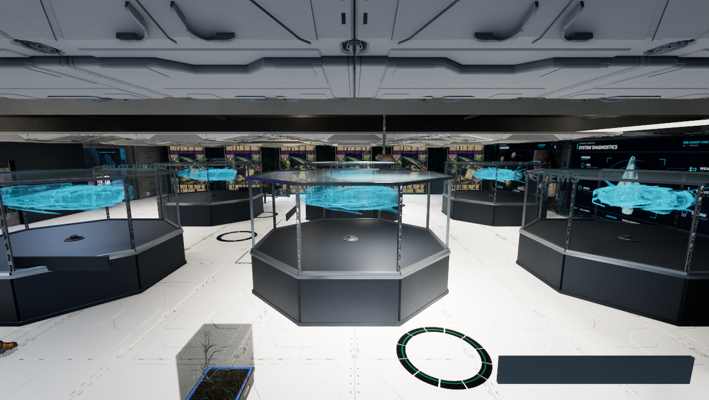
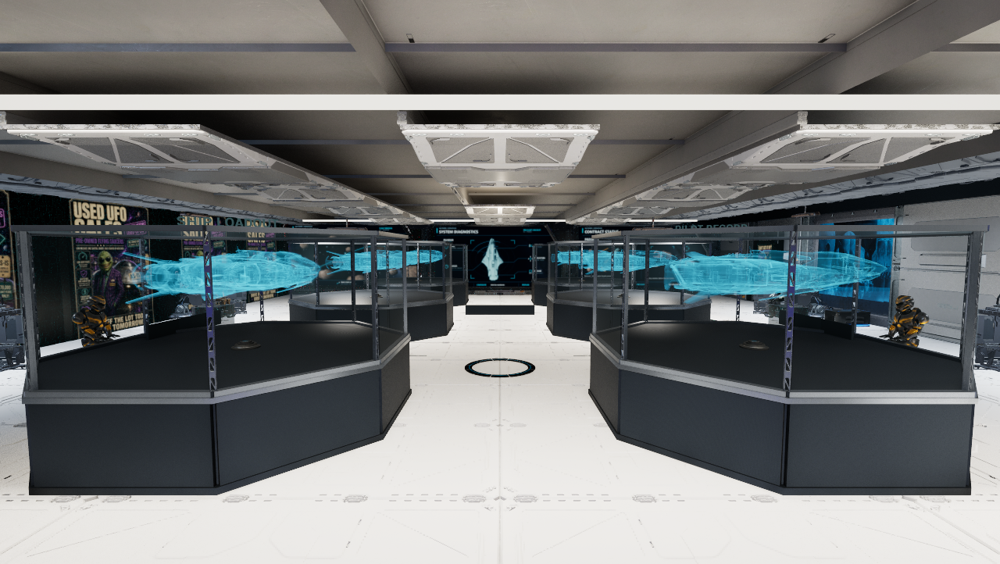

# T ship-display layout preview — October 10, 2026

The complete existing Phoenix setup is copied five times into two rows of three. Each bay retains its60-part podium/glass/projector/ship/pivot/sequence assembly and shared materials. All six rotate independently using the existing sequence; actor-specific serialized binding overrides and translation origins keep each ship in its own bay without editing the sequence asset. The original display is moved to the first slot.

Existing desk assemblies, their fittings and attached screens are moved aside;113 existing desk actors move. All8,934 other existing actor/component fingerprints are unchanged before save, including owner art, lights, service actors and NPCs. No actor is deleted, no desk redesigned and no other room changed. Existing service markers/labels remain where they were. The five copied Phoenix setups are visual placeholders for future ships; no ship purchase/stats/flight-record mechanics are added.

Saved Wayfarer SHA256 `b6496c2e9ae9b245cb27a6ab137190a8cdf895c6bca461e578ae6fc708a8fbe4`,9,407 actors, supersedes the prior9,107-actor stage checkpoint. Reload244 verifies six complete displays, six sequence actors, the2×3 positions, serialized bindings and clean packages. Ordinary Play243 captures two unedited1280×722 views;25 sampled frames each contain six pivots, stable positions and advancing yaw. Finalization restores camera/HUD/temporary settings and preserves production saves. Native245 verifies the isolated save paths and clean map/content packages; the task editor closes. Ray tracing remains OFF. This is layout/motion evidence, not owner visual or performance acceptance.

The initial238 hash lookup failed on an Engine asset before copying. Attempt239 subsequently crashed in the editor's runtime SetBinding call before saving; the original disk map stayed unchanged. These failures remain private and are not relabeled as passes. The corrected241 path sets serialized binding data without that method and preserves all shared asset bytes.

`Scripts/StageTShipRows235.py` is the exact executed one-time recipe; never replay it on the adopted map. Native before-map/full snapshots/receipts remain under `.agent/local/StationRefinement/TShipRows241`, with the failed attempt under TShipRows235 and native run under Outpost/LiveOperationsPIEReview1_TShipRows243. GitHub contains source/docs/images, not a full licensed/native-content or manual-edit backup. Build55 and the published release are unchanged; no cook, release or merge. [Structured evidence](2026-10-10-t-ship-rows.json). [Room-purpose plan](../GAME_SCOPE.md#owner-amendment--october-10-2026-station-room-purposes).
